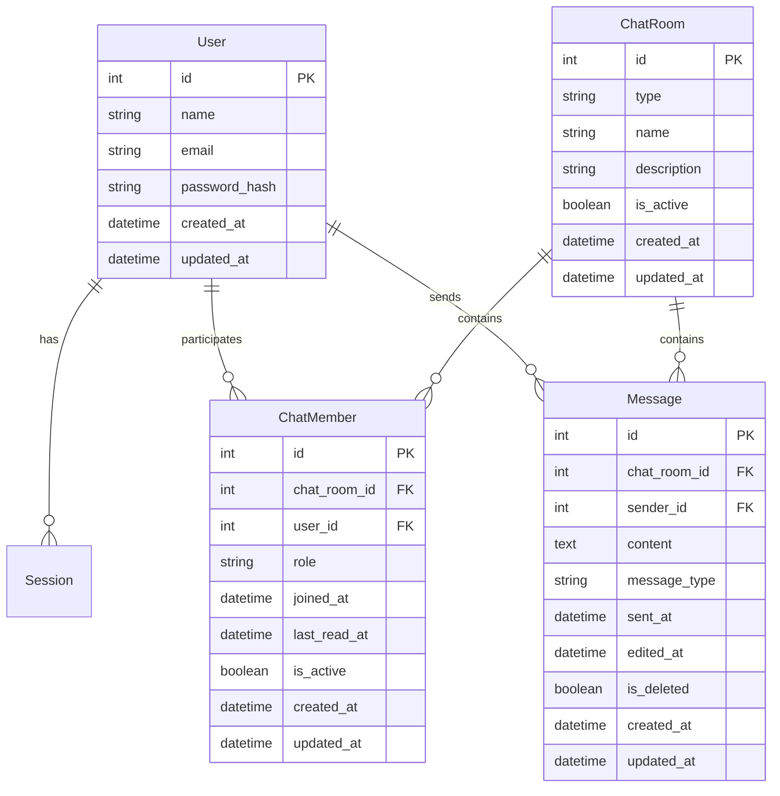

# チャット機能 データベース詳細設計書

## 概要

本ドキュメントは、チャット機能に必要なデータベーススキーマの詳細設計とPrismaスキーマファイルの更新内容を定義します。既存のUser、Session テーブルとの整合性を保ちながら、スケーラブルなチャットシステムを構築します。

## データベース設計原則

### 1. 正規化レベル: 第3正規形
- データの重複を排除
- 更新異常を防止
- 参照整合性の保証

### 2. パフォーマンス考慮
- 適切なインデックス設計
- クエリ最適化を考慮したカラム設計
- 将来的なパーティショニング対応

### 3. 拡張性の確保
- 新機能追加に対応可能な設計
- メッセージタイプ拡張対応
- 国際化対応

## ER図



## テーブル定義詳細

### 1. chat_rooms テーブル
**用途**: チャットルーム（1対1、グループ）の基本情報

| カラム名 | 型 | 制約 | 説明 |
|---------|---|------|-----|
| id | INT | PK, AUTO_INCREMENT | ルームID |
| type | VARCHAR(20) | NOT NULL | ルームタイプ ('DIRECT', 'GROUP') |
| name | VARCHAR(100) | NULL | ルーム名（グループチャットのみ） |
| description | TEXT | NULL | ルーム説明 |
| is_active | BOOLEAN | NOT NULL, DEFAULT TRUE | アクティブ状態 |
| created_at | TIMESTAMP | NOT NULL, DEFAULT NOW() | 作成日時 |
| updated_at | TIMESTAMP | NULL, ON UPDATE NOW() | 更新日時 |

**インデックス:**
```sql
CREATE INDEX idx_chat_rooms_type_active ON chat_rooms(type, is_active);
CREATE INDEX idx_chat_rooms_created_at ON chat_rooms(created_at);
```

### 2. chat_members テーブル
**用途**: チャットルームとユーザーの関連（参加者管理）

| カラム名 | 型 | 制約 | 説明 |
|---------|---|------|-----|
| id | INT | PK, AUTO_INCREMENT | メンバーID |
| chat_room_id | INT | NOT NULL, FK | チャットルームID |
| user_id | INT | NOT NULL, FK | ユーザーID |
| role | VARCHAR(20) | NOT NULL, DEFAULT 'MEMBER' | 役割 ('MEMBER', 'ADMIN', 'OWNER') |
| joined_at | TIMESTAMP | NOT NULL, DEFAULT NOW() | 参加日時 |
| last_read_at | TIMESTAMP | NULL | 最終既読日時 |
| is_active | BOOLEAN | NOT NULL, DEFAULT TRUE | アクティブ状態 |
| created_at | TIMESTAMP | NOT NULL, DEFAULT NOW() | 作成日時 |
| updated_at | TIMESTAMP | NULL, ON UPDATE NOW() | 更新日時 |

**インデックス:**
```sql
CREATE INDEX idx_chat_members_room_user ON chat_members(chat_room_id, user_id);
CREATE INDEX idx_chat_members_user_active ON chat_members(user_id, is_active);
CREATE INDEX idx_chat_members_room_active ON chat_members(chat_room_id, is_active);
CREATE UNIQUE INDEX idx_chat_members_unique ON chat_members(chat_room_id, user_id);
```

### 3. messages テーブル
**用途**: チャットメッセージの保存

| カラム名 | 型 | 制約 | 説明 |
|---------|---|------|-----|
| id | INT | PK, AUTO_INCREMENT | メッセージID |
| chat_room_id | INT | NOT NULL, FK | チャットルームID |
| sender_id | INT | NOT NULL, FK | 送信者ID |
| content | TEXT | NOT NULL | メッセージ内容 |
| message_type | VARCHAR(20) | NOT NULL, DEFAULT 'TEXT' | メッセージタイプ ('TEXT', 'IMAGE', 'FILE', 'SYSTEM') |
| sent_at | TIMESTAMP | NOT NULL, DEFAULT NOW() | 送信日時 |
| edited_at | TIMESTAMP | NULL | 編集日時 |
| is_deleted | BOOLEAN | NOT NULL, DEFAULT FALSE | 削除フラグ |
| created_at | TIMESTAMP | NOT NULL, DEFAULT NOW() | 作成日時 |
| updated_at | TIMESTAMP | NULL, ON UPDATE NOW() | 更新日時 |

**インデックス:**
```sql
CREATE INDEX idx_messages_chat_room_sent_at ON messages(chat_room_id, sent_at DESC);
CREATE INDEX idx_messages_sender_sent_at ON messages(sender_id, sent_at DESC);
CREATE INDEX idx_messages_room_type_sent ON messages(chat_room_id, message_type, sent_at DESC);
```

## Prismaスキーマ更新内容

### 完全なスキーマファイル（schema.prisma）

```prisma
// This is your Prisma schema file,
// learn more about it in the docs: https://pris.ly/d/prisma-schema

generator client {
  provider = "prisma-client-js"
}

datasource db {
  provider = "postgresql"
  url      = env("DATABASE_URL")
}

// 既存テーブル
model User {
  id           Int       @id @default(autoincrement())
  name         String    @db.VarChar(50)
  email        String    @unique @db.VarChar(255)
  passwordHash String    @map("password_hash") @db.VarChar(255)
  createdAt    DateTime  @default(now()) @map("created_at")
  updatedAt    DateTime? @updatedAt @map("updated_at")

  // Relations (既存)
  sessions Session[]
  
  // Relations (新規追加)
  chatMembers ChatMember[] @relation("UserChatMembers")
  sentMessages Message[]   @relation("UserSentMessages")

  @@index([email])
  @@map("users")
}

model Session {
  id        String   @id @db.VarChar(255)
  userId    Int      @map("user_id")
  expiresAt DateTime @map("expires_at")
  createdAt DateTime @default(now()) @map("created_at")

  // Relations
  user User @relation(fields: [userId], references: [id], onDelete: Cascade)

  @@index([userId])
  @@index([expiresAt])
  @@map("sessions")
}

// 新規追加テーブル
model ChatRoom {
  id          Int       @id @default(autoincrement())
  type        ChatRoomType @default(DIRECT)
  name        String?   @db.VarChar(100)
  description String?   @db.Text
  isActive    Boolean   @default(true) @map("is_active")
  createdAt   DateTime  @default(now()) @map("created_at")
  updatedAt   DateTime? @updatedAt @map("updated_at")

  // Relations
  members  ChatMember[] @relation("ChatRoomMembers")
  messages Message[]    @relation("ChatRoomMessages")

  @@index([type, isActive], name: "idx_chat_rooms_type_active")
  @@index([createdAt], name: "idx_chat_rooms_created_at")
  @@map("chat_rooms")
}

model ChatMember {
  id         Int       @id @default(autoincrement())
  chatRoomId Int       @map("chat_room_id")
  userId     Int       @map("user_id")
  role       MemberRole @default(MEMBER)
  joinedAt   DateTime  @default(now()) @map("joined_at")
  lastReadAt DateTime? @map("last_read_at")
  isActive   Boolean   @default(true) @map("is_active")
  createdAt  DateTime  @default(now()) @map("created_at")
  updatedAt  DateTime? @updatedAt @map("updated_at")

  // Relations
  chatRoom ChatRoom @relation("ChatRoomMembers", fields: [chatRoomId], references: [id], onDelete: Cascade)
  user     User     @relation("UserChatMembers", fields: [userId], references: [id], onDelete: Cascade)

  @@unique([chatRoomId, userId], name: "idx_chat_members_unique")
  @@index([chatRoomId, isActive], name: "idx_chat_members_room_active")
  @@index([userId, isActive], name: "idx_chat_members_user_active")
  @@map("chat_members")
}

model Message {
  id          Int         @id @default(autoincrement())
  chatRoomId  Int         @map("chat_room_id")
  senderId    Int         @map("sender_id")
  content     String      @db.Text
  messageType MessageType @default(TEXT) @map("message_type")
  sentAt      DateTime    @default(now()) @map("sent_at")
  editedAt    DateTime?   @map("edited_at")
  isDeleted   Boolean     @default(false) @map("is_deleted")
  createdAt   DateTime    @default(now()) @map("created_at")
  updatedAt   DateTime?   @updatedAt @map("updated_at")

  // Relations
  chatRoom ChatRoom @relation("ChatRoomMessages", fields: [chatRoomId], references: [id], onDelete: Cascade)
  sender   User     @relation("UserSentMessages", fields: [senderId], references: [id], onDelete: Cascade)

  @@index([chatRoomId, sentAt], name: "idx_messages_chat_room_sent_at", map: "idx_messages_room_sent")
  @@index([senderId, sentAt], name: "idx_messages_sender_sent_at")
  @@index([chatRoomId, messageType, sentAt], name: "idx_messages_room_type_sent")
  @@map("messages")
}

// Enum定義
enum ChatRoomType {
  DIRECT
  GROUP

  @@map("chat_room_type")
}

enum MemberRole {
  MEMBER
  ADMIN
  OWNER

  @@map("member_role")
}

enum MessageType {
  TEXT
  IMAGE
  FILE
  SYSTEM

  @@map("message_type")
}
```

## マイグレーション戦略

### 1. マイグレーションファイル作成順序
```bash
# 1. Enumの作成
npx prisma db push --preview-feature  # Enum作成

# 2. テーブル作成（依存関係順）
# - chat_rooms (独立)
# - chat_members (chat_rooms, usersに依存)  
# - messages (chat_rooms, usersに依存)

# 3. インデックス作成
# - パフォーマンス最適化のため
```

### 2. ロールバック戦略
```sql
-- ロールバック用SQL（緊急時）
DROP TABLE IF EXISTS messages;
DROP TABLE IF EXISTS chat_members;
DROP TABLE IF EXISTS chat_rooms;
DROP TYPE IF EXISTS message_type;
DROP TYPE IF EXISTS member_role;
DROP TYPE IF EXISTS chat_room_type;
```

## クエリ最適化設計

### 1. よく使用されるクエリパターン

#### チャットルーム一覧取得
```sql
-- ユーザーが参加しているアクティブなチャットルーム
SELECT cr.*, 
       COUNT(CASE WHEN m.sent_at > cm.last_read_at THEN 1 END) as unread_count,
       MAX(m.sent_at) as last_message_at
FROM chat_rooms cr
JOIN chat_members cm ON cr.id = cm.chat_room_id
LEFT JOIN messages m ON cr.id = m.chat_room_id AND m.is_deleted = false
WHERE cm.user_id = ? AND cm.is_active = true AND cr.is_active = true
GROUP BY cr.id
ORDER BY last_message_at DESC NULLS LAST;
```

#### メッセージ履歴取得（ページネーション）
```sql
-- 指定チャットルームのメッセージ履歴（20件ずつ）
SELECT m.*, u.name as sender_name
FROM messages m
JOIN users u ON m.sender_id = u.id
WHERE m.chat_room_id = ? 
  AND m.is_deleted = false
  AND m.sent_at < ?  -- cursor-based pagination
ORDER BY m.sent_at DESC
LIMIT 21;  -- +1 for hasNext判定
```

### 2. パフォーマンス最適化

#### インデックス使用効率
```sql
-- messages テーブルのクエリパターン別インデックス利用
-- パターン1: ルーム内メッセージ履歴 → idx_messages_chat_room_sent_at
-- パターン2: ユーザー送信履歴 → idx_messages_sender_sent_at  
-- パターン3: タイプ別メッセージ → idx_messages_room_type_sent
```

#### クエリ実行計画の確認
```sql
-- 重要クエリの実行計画確認
EXPLAIN (ANALYZE, BUFFERS) 
SELECT /* チャットルーム一覧取得クエリ */;
```

## データ保存期間とアーカイブ戦略

### 1. データライフサイクル管理

#### メッセージ保存期間
```typescript
interface MessageRetentionPolicy {
  activeMessages: '1 year'        // アクティブメッセージ保持期間
  archivedMessages: '3 years'     // アーカイブメッセージ保持期間  
  deletedMessages: '30 days'      // 論理削除メッセージ保持期間
}
```

#### アーカイブ対象
- 1年以上前のメッセージ
- 非アクティブなチャットルームのメッセージ
- 削除されたユーザーのメッセージ

### 2. パーティション戦略（将来実装）

#### 時間ベースパーティション
```sql
-- PostgreSQL 12+ パーティション設計
CREATE TABLE messages (
  -- columns...
) PARTITION BY RANGE (sent_at);

-- 月次パーティション
CREATE TABLE messages_2025_08 PARTITION OF messages
FOR VALUES FROM ('2025-08-01') TO ('2025-09-01');
```

## バックアップ・リストア戦略

### 1. バックアップ設計
```bash
# チャット関連データのみバックアップ
pg_dump -d nanika_game -t chat_rooms -t chat_members -t messages > chat_backup.sql

# 全体バックアップ（定期実行）
pg_dump -d nanika_game > full_backup.sql
```

### 2. リストア手順
```bash
# 1. テーブル削除（必要に応じて）
# 2. スキーマリストア
# 3. データリストア
# 4. インデックス再作成
# 5. 整合性チェック
```

## データ整合性制約

### 1. 外部キー制約
```sql
-- chat_members
ALTER TABLE chat_members 
  ADD CONSTRAINT fk_chat_members_room 
  FOREIGN KEY (chat_room_id) REFERENCES chat_rooms(id) ON DELETE CASCADE;

ALTER TABLE chat_members 
  ADD CONSTRAINT fk_chat_members_user 
  FOREIGN KEY (user_id) REFERENCES users(id) ON DELETE CASCADE;

-- messages
ALTER TABLE messages 
  ADD CONSTRAINT fk_messages_room 
  FOREIGN KEY (chat_room_id) REFERENCES chat_rooms(id) ON DELETE CASCADE;

ALTER TABLE messages 
  ADD CONSTRAINT fk_messages_sender 
  FOREIGN KEY (sender_id) REFERENCES users(id) ON DELETE CASCADE;
```

### 2. チェック制約
```sql
-- メッセージ内容の長さ制限
ALTER TABLE messages 
  ADD CONSTRAINT chk_messages_content_length 
  CHECK (LENGTH(content) > 0 AND LENGTH(content) <= 10000);

-- チャットルーム名の制約（グループチャットの場合必須）
ALTER TABLE chat_rooms 
  ADD CONSTRAINT chk_chat_rooms_group_name 
  CHECK (type = 'DIRECT' OR (type = 'GROUP' AND name IS NOT NULL));
```

## セキュリティ考慮事項

### 1. データ暗号化
```sql
-- 機密メッセージの暗号化（将来実装）
-- content カラムをBYTEA型に変更し、アプリレイヤーで暗号化
ALTER TABLE messages ADD COLUMN encrypted_content BYTEA;
```

### 2. アクセス制御
```sql
-- データベースユーザー権限設定
-- アプリケーション用ユーザー: 読み書き権限のみ
-- 管理用ユーザー: DDL権限含む
-- 読み取り専用ユーザー: SELECT権限のみ
```

### 3. 監査ログ
```sql
-- 重要操作の監査ログ（将来実装）
CREATE TABLE audit_logs (
  id SERIAL PRIMARY KEY,
  table_name VARCHAR(50),
  operation VARCHAR(10),  -- INSERT, UPDATE, DELETE
  user_id INT,
  changed_data JSONB,
  created_at TIMESTAMP DEFAULT NOW()
);
```

## パフォーマンステスト設計

### 1. 負荷テストシナリオ
```typescript
interface LoadTestScenarios {
  concurrentUsers: 1000           // 同時ユーザー数
  messagesPerSecond: 100         // 秒間メッセージ数
  chatRooms: 100                 // 同時アクティブルーム数
  testDuration: '30 minutes'     // テスト実行時間
}
```

### 2. パフォーマンス目標値
```typescript
interface PerformanceTargets {
  messageInsert: '< 10ms'        // メッセージ挿入
  roomListQuery: '< 100ms'       // ルーム一覧取得
  messageHistoryQuery: '< 200ms' // メッセージ履歴取得
  memberListQuery: '< 50ms'      // メンバー一覧取得
}
```

## トラブルシューティング

### 1. よくある問題と対策

#### デッドロック対策
```sql
-- トランザクション順序の統一
-- 常にテーブルを同じ順序でロック
-- タイムアウト設定の適切な調整
SET lock_timeout = '10s';
SET deadlock_timeout = '1s';
```

#### インデックス肥大化対策
```sql
-- 定期的なインデックス再構築
REINDEX TABLE messages;
ANALYZE messages;
```

### 2. 監視項目
```sql
-- テーブルサイズ監視
SELECT schemaname, tablename, 
       pg_size_pretty(pg_total_relation_size(schemaname||'.'||tablename)) as size
FROM pg_tables 
WHERE tablename IN ('chat_rooms', 'chat_members', 'messages');

-- インデックス使用状況
SELECT indexrelname, idx_scan, idx_tup_read, idx_tup_fetch
FROM pg_stat_user_indexes 
WHERE relname IN ('chat_rooms', 'chat_members', 'messages');
```

---

**更新履歴:**
- 2025-08-10: 初回作成（architecture-specialist）
- 2025-08-10: インデックス設計詳細化
- 2025-08-10: パーティション戦略追加
- 2025-08-10: セキュリティ設計強化