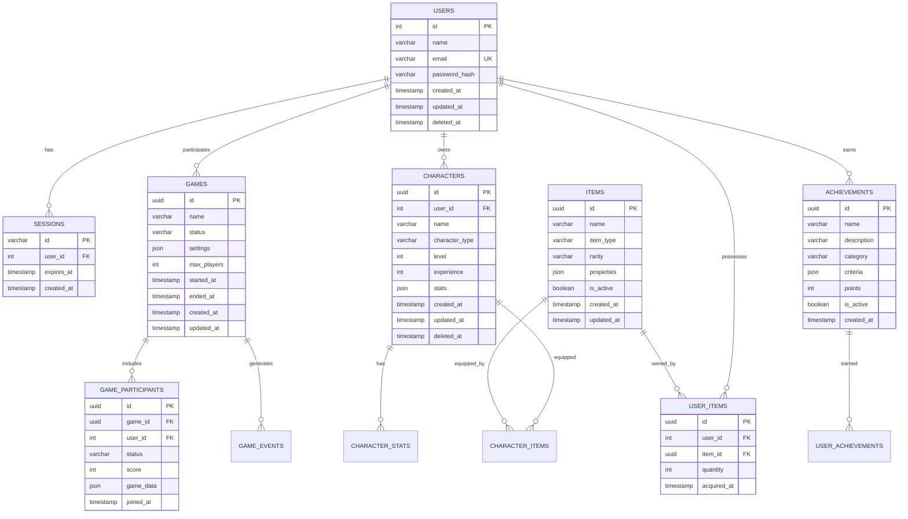

# データベース設計

## 目的と概要

このドキュメントは、Nanika Gameプロジェクトのデータベース設計について詳述します。PostgreSQLとPrismaを使用し、DDDアーキテクチャに適したデータモデル設計とゲームアプリケーションの要件に最適化されたスキーマを提供します。

## 現在の実装状況

- **PostgreSQL** をメインデータベースとして使用
- **Prisma ORM** によるタイプセーフなデータアクセス
- 基本的な認証機能のテーブル実装済み（users, sessions）
- UUIDベースの主キー設計（将来のスケーラビリティを考慮）
- ソフトデリートサポート準備
- インデックス最適化実装済み

## データベース技術スタック

### 主要技術
- **データベース**: PostgreSQL 15+
- **ORM**: Prisma 6.13+
- **接続プール**: Prisma内蔵プール機能
- **マイグレーション**: Prisma Migrate

### 設計原則
- **正規化**: 第3正規形まで実施
- **参照整合性**: 外部キー制約による保証
- **パフォーマンス**: 適切なインデックス設計
- **拡張性**: パーティショニング対応準備
- **型安全性**: Prisma Clientによる型生成

## ER図



## テーブル設計

### 1. users テーブル（現在実装済み）

```sql
-- ユーザーアカウント情報
CREATE TABLE users (
    id SERIAL PRIMARY KEY,
    name VARCHAR(50) NOT NULL,
    email VARCHAR(255) UNIQUE NOT NULL,
    password_hash VARCHAR(255) NOT NULL,
    created_at TIMESTAMP DEFAULT CURRENT_TIMESTAMP,
    updated_at TIMESTAMP,
    deleted_at TIMESTAMP NULL -- ソフトデリート用
);

-- インデックス
CREATE INDEX idx_users_email ON users(email);
CREATE INDEX idx_users_deleted_at ON users(deleted_at) WHERE deleted_at IS NULL;
```

**設計判断:**
- `id`: 整数型でシンプル、既存システムとの互換性
- `email`: ユニーク制約でログイン識別子として使用
- `password_hash`: bcryptハッシュ値を格納
- `deleted_at`: ソフトデリートでデータ保全

### 2. sessions テーブル（現在実装済み）

```sql
-- セッション管理
CREATE TABLE sessions (
    id VARCHAR(255) PRIMARY KEY, -- セッショントークン
    user_id INTEGER NOT NULL REFERENCES users(id) ON DELETE CASCADE,
    expires_at TIMESTAMP NOT NULL,
    created_at TIMESTAMP DEFAULT CURRENT_TIMESTAMP
);

-- インデックス
CREATE INDEX idx_sessions_user_id ON sessions(user_id);
CREATE INDEX idx_sessions_expires_at ON sessions(expires_at);
```

**設計判断:**
- `id`: セッショントークン自体をPKとして使用
- `expires_at`: セッション期限管理とクリーンアップに使用
- CASCADE削除: ユーザー削除時にセッションも自動削除

### 3. games テーブル（将来実装）

```sql
-- ゲームセッション
CREATE TABLE games (
    id UUID PRIMARY KEY DEFAULT gen_random_uuid(),
    name VARCHAR(100) NOT NULL,
    status VARCHAR(20) NOT NULL DEFAULT 'waiting', -- waiting, playing, finished, cancelled
    settings JSONB NOT NULL DEFAULT '{}',
    max_players INTEGER NOT NULL DEFAULT 4,
    started_at TIMESTAMP NULL,
    ended_at TIMESTAMP NULL,
    created_at TIMESTAMP DEFAULT CURRENT_TIMESTAMP,
    updated_at TIMESTAMP
);

-- インデックス
CREATE INDEX idx_games_status ON games(status);
CREATE INDEX idx_games_created_at ON games(created_at DESC);
CREATE INDEX idx_games_settings_gin ON games USING GIN(settings);
```

### 4. characters テーブル（将来実装）

```sql
-- プレイヤーキャラクター
CREATE TABLE characters (
    id UUID PRIMARY KEY DEFAULT gen_random_uuid(),
    user_id INTEGER NOT NULL REFERENCES users(id) ON DELETE CASCADE,
    name VARCHAR(50) NOT NULL,
    character_type VARCHAR(30) NOT NULL, -- warrior, mage, archer等
    level INTEGER NOT NULL DEFAULT 1,
    experience INTEGER NOT NULL DEFAULT 0,
    stats JSONB NOT NULL DEFAULT '{}', -- hp, mp, strength等
    created_at TIMESTAMP DEFAULT CURRENT_TIMESTAMP,
    updated_at TIMESTAMP,
    deleted_at TIMESTAMP NULL
);

-- インデックス
CREATE INDEX idx_characters_user_id ON characters(user_id);
CREATE INDEX idx_characters_level ON characters(level DESC);
CREATE INDEX idx_characters_deleted_at ON characters(deleted_at) WHERE deleted_at IS NULL;
```

### 5. items テーブル（将来実装）

```sql
-- アイテムマスターデータ
CREATE TABLE items (
    id UUID PRIMARY KEY DEFAULT gen_random_uuid(),
    name VARCHAR(100) NOT NULL,
    item_type VARCHAR(30) NOT NULL, -- weapon, armor, consumable, special
    rarity VARCHAR(20) NOT NULL DEFAULT 'common', -- common, rare, epic, legendary
    properties JSONB NOT NULL DEFAULT '{}', -- アイテム固有属性
    is_active BOOLEAN NOT NULL DEFAULT true,
    created_at TIMESTAMP DEFAULT CURRENT_TIMESTAMP,
    updated_at TIMESTAMP
);

-- インデックス
CREATE INDEX idx_items_type_rarity ON items(item_type, rarity);
CREATE INDEX idx_items_is_active ON items(is_active) WHERE is_active = true;
```

### 6. user_items テーブル（将来実装）

```sql
-- ユーザーアイテム所持情報
CREATE TABLE user_items (
    id UUID PRIMARY KEY DEFAULT gen_random_uuid(),
    user_id INTEGER NOT NULL REFERENCES users(id) ON DELETE CASCADE,
    item_id UUID NOT NULL REFERENCES items(id),
    quantity INTEGER NOT NULL DEFAULT 1,
    acquired_at TIMESTAMP DEFAULT CURRENT_TIMESTAMP
);

-- インデックス
CREATE INDEX idx_user_items_user_id ON user_items(user_id);
CREATE INDEX idx_user_items_item_id ON user_items(item_id);
CREATE UNIQUE INDEX idx_user_items_user_item ON user_items(user_id, item_id);
```

### 7. achievements テーブル（将来実装）

```sql
-- 実績マスターデータ
CREATE TABLE achievements (
    id UUID PRIMARY KEY DEFAULT gen_random_uuid(),
    name VARCHAR(100) NOT NULL,
    description TEXT NOT NULL,
    category VARCHAR(50) NOT NULL, -- gameplay, social, progression
    criteria JSONB NOT NULL, -- 達成条件
    points INTEGER NOT NULL DEFAULT 0,
    is_active BOOLEAN NOT NULL DEFAULT true,
    created_at TIMESTAMP DEFAULT CURRENT_TIMESTAMP
);

-- インデックス
CREATE INDEX idx_achievements_category ON achievements(category);
CREATE INDEX idx_achievements_is_active ON achievements(is_active) WHERE is_active = true;
```

### 8. user_achievements テーブル（将来実装）

```sql
-- ユーザー実績達成情報
CREATE TABLE user_achievements (
    id UUID PRIMARY KEY DEFAULT gen_random_uuid(),
    user_id INTEGER NOT NULL REFERENCES users(id) ON DELETE CASCADE,
    achievement_id UUID NOT NULL REFERENCES achievements(id),
    progress JSONB DEFAULT '{}', -- 進捗データ
    completed_at TIMESTAMP NULL,
    created_at TIMESTAMP DEFAULT CURRENT_TIMESTAMP
);

-- インデックス
CREATE INDEX idx_user_achievements_user_id ON user_achievements(user_id);
CREATE INDEX idx_user_achievements_completed ON user_achievements(completed_at) WHERE completed_at IS NOT NULL;
CREATE UNIQUE INDEX idx_user_achievements_unique ON user_achievements(user_id, achievement_id);
```

### 9. game_participants テーブル（将来実装）

```sql
-- ゲーム参加者情報
CREATE TABLE game_participants (
    id UUID PRIMARY KEY DEFAULT gen_random_uuid(),
    game_id UUID NOT NULL REFERENCES games(id) ON DELETE CASCADE,
    user_id INTEGER NOT NULL REFERENCES users(id),
    character_id UUID REFERENCES characters(id),
    status VARCHAR(20) NOT NULL DEFAULT 'joined', -- joined, playing, finished, left
    score INTEGER DEFAULT 0,
    game_data JSONB DEFAULT '{}', -- ゲーム固有データ
    joined_at TIMESTAMP DEFAULT CURRENT_TIMESTAMP
);

-- インデックス
CREATE INDEX idx_game_participants_game_id ON game_participants(game_id);
CREATE INDEX idx_game_participants_user_id ON game_participants(user_id);
CREATE UNIQUE INDEX idx_game_participants_unique ON game_participants(game_id, user_id);
```

## Prismaスキーマ（現在の実装）

```prisma
// prisma/schema.prisma
generator client {
  provider = "prisma-client-js"
}

datasource db {
  provider = "postgresql"
  url      = env("DATABASE_URL")
}

model User {
  id           Int       @id @default(autoincrement())
  name         String    @db.VarChar(50)
  email        String    @unique @db.VarChar(255)
  passwordHash String    @map("password_hash") @db.VarChar(255)
  createdAt    DateTime  @default(now()) @map("created_at")
  updatedAt    DateTime? @updatedAt @map("updated_at")

  // Relations
  sessions Session[]

  @@index([email])
  @@map("users")
}

model Session {
  id        String   @id @db.VarChar(255)
  userId    Int      @map("user_id")
  expiresAt DateTime @map("expires_at")
  createdAt DateTime @default(now()) @map("created_at")

  // Relations
  user User @relation(fields: [userId], references: [id], onDelete: Cascade)

  @@index([userId])
  @@index([expiresAt])
  @@map("sessions")
}
```

## 将来の拡張Prismaスキーマ

```prisma
// 将来のゲーム機能追加時のスキーマ例
model Game {
  id          String   @id @default(dbgenerated("gen_random_uuid()")) @db.Uuid
  name        String   @db.VarChar(100)
  status      String   @default("waiting") @db.VarChar(20)
  settings    Json     @default("{}")
  maxPlayers  Int      @default(4) @map("max_players")
  startedAt   DateTime? @map("started_at")
  endedAt     DateTime? @map("ended_at")
  createdAt   DateTime @default(now()) @map("created_at")
  updatedAt   DateTime @updatedAt @map("updated_at")

  // Relations
  participants GameParticipant[]

  @@index([status])
  @@index([createdAt(sort: Desc)])
  @@map("games")
}

model Character {
  id            String    @id @default(dbgenerated("gen_random_uuid()")) @db.Uuid
  userId        Int       @map("user_id")
  name          String    @db.VarChar(50)
  characterType String    @map("character_type") @db.VarChar(30)
  level         Int       @default(1)
  experience    Int       @default(0)
  stats         Json      @default("{}")
  createdAt     DateTime  @default(now()) @map("created_at")
  updatedAt     DateTime  @updatedAt @map("updated_at")
  deletedAt     DateTime? @map("deleted_at")

  // Relations
  user         User              @relation(fields: [userId], references: [id], onDelete: Cascade)
  gameParticipants GameParticipant[]

  @@index([userId])
  @@index([level(sort: Desc)])
  @@map("characters")
}
```

## インデックス戦略

### パフォーマンス最適化

#### 1. 頻繁なクエリパターンのインデックス

```sql
-- ログイン認証用
CREATE INDEX idx_users_email_password ON users(email) WHERE deleted_at IS NULL;

-- セッション検索・クリーンアップ用
CREATE INDEX idx_sessions_expires_at_active ON sessions(expires_at) WHERE expires_at > NOW();

-- ゲーム検索用（将来）
CREATE INDEX idx_games_status_created ON games(status, created_at DESC);
```

#### 2. 複合インデックス

```sql
-- ユーザーのアクティブキャラクター検索
CREATE INDEX idx_characters_user_active ON characters(user_id, deleted_at) WHERE deleted_at IS NULL;

-- ゲーム参加者のスコア順位
CREATE INDEX idx_game_participants_score ON game_participants(game_id, score DESC);
```

#### 3. 部分インデックス

```sql
-- アクティブなアイテムのみ
CREATE INDEX idx_items_active_type ON items(item_type) WHERE is_active = true;

-- 未完了の実績のみ
CREATE INDEX idx_user_achievements_incomplete ON user_achievements(user_id) WHERE completed_at IS NULL;
```

## データベースパフォーマンス戦略

### 1. クエリ最適化

#### N+1問題の回避
```typescript
// Prismaでのリレーション効率的取得
const usersWithSessions = await prisma.user.findMany({
  include: {
    sessions: {
      where: {
        expiresAt: {
          gt: new Date()
        }
      }
    }
  }
});
```

#### バッチ処理
```typescript
// 複数レコードの効率的な作成
await prisma.userItem.createMany({
  data: itemRewards.map(item => ({
    userId: user.id,
    itemId: item.id,
    quantity: item.quantity
  })),
  skipDuplicates: true
});
```

### 2. 接続プール設定

```typescript
// prisma/schema.prisma
datasource db {
  provider = "postgresql"
  url      = env("DATABASE_URL")
  // 接続プール設定
  // ?connection_limit=10&pool_timeout=20&socket_timeout=20
}
```

### 3. データベース保守

#### 定期クリーンアップ
```sql
-- 期限切れセッションのクリーンアップ
DELETE FROM sessions WHERE expires_at < NOW() - INTERVAL '1 day';

-- ソフトデリートされた古いレコードの物理削除
DELETE FROM users WHERE deleted_at < NOW() - INTERVAL '1 year';
```

#### 統計情報の更新
```sql
-- PostgreSQL統計情報更新
ANALYZE users;
ANALYZE sessions;
```

## セキュリティ考慮事項

### 1. データ保護

```sql
-- 行レベルセキュリティ（RLS）の例
ALTER TABLE users ENABLE ROW LEVEL SECURITY;

-- ユーザーは自分のデータのみアクセス可能
CREATE POLICY user_access_policy ON users
  FOR ALL
  TO application_role
  USING (id = current_setting('app.current_user_id')::integer);
```

### 2. 機密データの暗号化

```sql
-- パスワードハッシュの適切な長さ確保
ALTER TABLE users ADD CONSTRAINT check_password_hash_length 
  CHECK (length(password_hash) >= 60); -- bcrypt minimum
```

### 3. 監査ログ

```sql
-- 将来の監査ログテーブル
CREATE TABLE audit_logs (
    id UUID PRIMARY KEY DEFAULT gen_random_uuid(),
    table_name VARCHAR(50) NOT NULL,
    operation VARCHAR(10) NOT NULL, -- INSERT, UPDATE, DELETE
    old_values JSONB,
    new_values JSONB,
    user_id INTEGER REFERENCES users(id),
    timestamp TIMESTAMP DEFAULT CURRENT_TIMESTAMP
);
```

## バックアップ・災害対策

### 1. バックアップ戦略

```bash
# 日次フルバックアップ
pg_dump -h localhost -U nanika_user -d nanika_game > backup_$(date +%Y%m%d).sql

# WALアーカイブによるポイントインタイムリカバリ
# postgresql.confでWAL設定を有効化
```

### 2. レプリケーション（将来）

```sql
-- 読み取り専用レプリカの設定準備
-- primary_conninfo と recovery_target設定
```

## マイグレーション戦略

### 1. 無停止マイグレーション

```sql
-- 新カラム追加の例（3段階）
-- Step 1: カラム追加（NULL許可）
ALTER TABLE users ADD COLUMN profile_image_url VARCHAR(255);

-- Step 2: アプリケーション更新（新カラムを使用開始）
-- Step 3: NOT NULL制約追加（必要に応じて）
ALTER TABLE users ALTER COLUMN profile_image_url SET NOT NULL;
```

### 2. データ移行

```typescript
// Prismaでのデータ移行例
async function migrateUserData() {
  const users = await prisma.user.findMany();
  
  for (const user of users) {
    await prisma.user.update({
      where: { id: user.id },
      data: {
        // データ変換ロジック
      }
    });
  }
}
```

## 監視とメンテナンス

### 1. パフォーマンス監視

```sql
-- 低速クエリの監視
SELECT query, calls, mean_exec_time, rows
FROM pg_stat_statements
ORDER BY mean_exec_time DESC
LIMIT 10;

-- インデックス使用率の確認
SELECT schemaname, tablename, indexname, idx_tup_read, idx_tup_fetch
FROM pg_stat_user_indexes;
```

### 2. 容量管理

```sql
-- テーブルサイズの監視
SELECT 
  schemaname,
  tablename,
  pg_size_pretty(pg_total_relation_size(schemaname||'.'||tablename)) as size
FROM pg_tables
WHERE schemaname = 'public'
ORDER BY pg_total_relation_size(schemaname||'.'||tablename) DESC;
```

## 今後の拡張計画

### Phase 2: ゲーム機能拡張

1. **リアルタイム機能**
   - ゲーム状態のリアルタイム更新
   - WebSocketとの統合
   - イベント駆動アーキテクチャ

2. **分析データベース**
   - プレイヤー行動分析
   - ゲーム統計データ
   - 時系列データベース（TimescaleDB）の検討

3. **スケーリング対応**
   - 読み取りレプリカの導入
   - パーティショニング戦略
   - キャッシュレイヤーの統合

### Phase 3: マルチテナント対応

```sql
-- テナント分離の実装例
ALTER TABLE users ADD COLUMN tenant_id UUID REFERENCES tenants(id);
CREATE INDEX idx_users_tenant_id ON users(tenant_id);
```

## まとめ

本データベース設計は、現在の認証機能から始まり、将来のゲーム機能拡張に向けたスケーラブルな基盤を提供しています。PostgreSQLとPrismaの組み合わせにより、型安全性とパフォーマンスを両立しながら、ゲームアプリケーションの複雑な要件に対応できる柔軟な設計となっています。

継続的な監視と最適化を通じて、アプリケーションの成長に合わせてデータベースも進化させていきます。