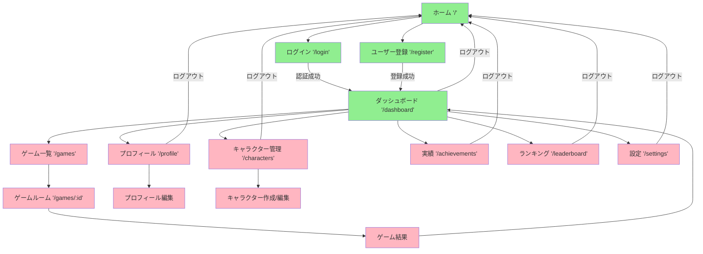

# 画面遷移設計

## 目的と概要

このドキュメントは、Nanika GameプロジェクトのUI/UX設計と画面遷移フローについて詳述します。React Router v7を活用したシングルページアプリケーション（SPA）として、直感的で応答性の高いユーザーエクスペリエンスを提供する画面設計を定義します。

## 現在の実装状況

- **基本認証フロー**: ログイン、登録、ダッシュボード画面を実装済み
- **React Router v7**: 最新のファイルベースルーティングシステム
- **認証ガード**: 保護されたルートへのアクセス制御
- **レスポンシブデザイン**: Tailwind CSSによるモバイルファースト設計
- **フォーム処理**: Server Actionsによるサーバーサイド処理

## 画面構成概要

### 現在実装済み画面

1. **ホーム画面** (`/`) - ランディングページ
2. **ログイン画面** (`/login`) - ユーザー認証
3. **ユーザー登録画面** (`/register`) - 新規アカウント作成
4. **ダッシュボード画面** (`/dashboard`) - メインハブ

### 将来実装予定画面

5. **ゲーム一覧画面** (`/games`) - 参加可能ゲーム表示
6. **ゲームルーム画面** (`/games/:id`) - ゲームプレイエリア
7. **プロフィール画面** (`/profile`) - ユーザー情報管理
8. **キャラクター管理画面** (`/characters`) - キャラクター作成・編集
9. **実績画面** (`/achievements`) - 獲得実績表示
10. **ランキング画面** (`/leaderboard`) - スコアランキング
11. **設定画面** (`/settings`) - アプリケーション設定

## 画面遷移フロー



## 詳細画面設計

### 1. ホーム画面 (`/`) - 実装済み

**目的**: ゲームの魅力を伝え、ユーザー登録・ログインへ導く

**レイアウト:**
```typescript
// app/web/routes/home.tsx
export default function Home() {
  return (
    <div className="min-h-screen bg-gradient-to-br from-blue-900 to-purple-900">
      {/* ヒーローセクション */}
      <section className="hero">
        <h1>Nanika Game へようこそ</h1>
        <p>友達と楽しめる新感覚ゲーム</p>
        <div className="cta-buttons">
          <Link to="/register">今すぐ始める</Link>
          <Link to="/login">ログイン</Link>
        </div>
      </section>

      {/* 機能紹介セクション */}
      <section className="features">
        <h2>ゲームの特徴</h2>
        <div className="feature-grid">
          {/* 特徴カード */}
        </div>
      </section>
    </div>
  );
}
```

**UIコンポーネント:**
- ヒーローセクション
- CTAボタン（登録・ログイン）
- 機能説明カード
- フッター

### 2. ログイン画面 (`/login`) - 実装済み

**目的**: セキュアで使いやすい認証体験を提供

**機能:**
- メールアドレス・パスワード入力
- バリデーションとエラー表示
- 「パスワードを忘れた」リンク（将来実装）
- 「アカウントを作成」リンク

```typescript
// app/web/routes/login.tsx
export default function Login() {
  const actionData = useActionData<typeof action>();
  const navigation = useNavigation();
  const isSubmitting = navigation.formAction === "/login";

  return (
    <div className="min-h-screen flex items-center justify-center bg-gray-50">
      <div className="max-w-md w-full space-y-8">
        <div className="text-center">
          <h2 className="text-3xl font-extrabold text-gray-900">
            アカウントにログイン
          </h2>
        </div>
        
        <Form method="post" className="mt-8 space-y-6">
          <div>
            <label htmlFor="email" className="sr-only">
              メールアドレス
            </label>
            <input
              id="email"
              name="email"
              type="email"
              required
              className="relative block w-full px-3 py-2 border border-gray-300 rounded-md"
              placeholder="メールアドレス"
            />
          </div>
          
          <div>
            <label htmlFor="password" className="sr-only">
              パスワード
            </label>
            <input
              id="password"
              name="password"
              type="password"
              required
              className="relative block w-full px-3 py-2 border border-gray-300 rounded-md"
              placeholder="パスワード"
            />
          </div>

          {actionData?.error && (
            <div className="text-red-600 text-sm">
              {actionData.error}
            </div>
          )}

          <button
            type="submit"
            disabled={isSubmitting}
            className="group relative w-full flex justify-center py-2 px-4 border border-transparent text-sm font-medium rounded-md text-white bg-indigo-600 hover:bg-indigo-700 focus:outline-none focus:ring-2 focus:ring-offset-2 focus:ring-indigo-500 disabled:opacity-50"
          >
            {isSubmitting ? 'ログイン中...' : 'ログイン'}
          </button>

          <div className="text-center">
            <Link 
              to="/register" 
              className="text-indigo-600 hover:text-indigo-500"
            >
              アカウントを作成
            </Link>
          </div>
        </Form>
      </div>
    </div>
  );
}
```

### 3. ダッシュボード画面 (`/dashboard`) - 実装済み

**目的**: ユーザーのメインハブ、全機能へのアクセス提供

**レイアウト:**
- ヘッダー（ユーザー名、ログアウト）
- ナビゲーションメニュー
- メインコンテンツエリア
- サイドバー（統計情報）

```typescript
// app/web/routes/dashboard.tsx
export default function Dashboard() {
  const user = useLoaderData<typeof loader>();

  return (
    <div className="min-h-screen bg-gray-100">
      {/* ヘッダー */}
      <header className="bg-white shadow">
        <div className="max-w-7xl mx-auto px-4 sm:px-6 lg:px-8">
          <div className="flex justify-between h-16">
            <div className="flex items-center">
              <h1 className="text-xl font-semibold">Nanika Game</h1>
            </div>
            <div className="flex items-center space-x-4">
              <span>こんにちは、{user.name}さん</span>
              <Form method="post" action="/logout">
                <button className="text-gray-500 hover:text-gray-700">
                  ログアウト
                </button>
              </Form>
            </div>
          </div>
        </div>
      </header>

      {/* メインコンテンツ */}
      <main className="max-w-7xl mx-auto py-6 sm:px-6 lg:px-8">
        <div className="px-4 py-6 sm:px-0">
          <div className="grid grid-cols-1 md:grid-cols-2 lg:grid-cols-3 gap-6">
            
            {/* クイックアクション */}
            <div className="bg-white overflow-hidden shadow rounded-lg">
              <div className="p-5">
                <h3 className="text-lg font-medium">ゲームを始める</h3>
                <p className="mt-1 text-sm text-gray-600">
                  新しいゲームに参加または作成
                </p>
                <div className="mt-3">
                  <Link
                    to="/games"
                    className="inline-flex items-center px-3 py-2 border border-transparent text-sm leading-4 font-medium rounded-md text-white bg-indigo-600 hover:bg-indigo-700"
                  >
                    ゲーム一覧へ
                  </Link>
                </div>
              </div>
            </div>

            {/* その他のカード */}
            {/* ... */}
          </div>
        </div>
      </main>
    </div>
  );
}
```

## 将来実装予定画面の詳細設計

### 4. ゲーム一覧画面 (`/games`)

**目的**: 参加可能なゲームを表示し、新規ゲーム作成機能を提供

**機能:**
- ゲーム一覧表示（フィルター・検索機能付き）
- ゲーム作成ボタン
- 参加ボタン
- ゲーム状態表示（待機中、進行中、終了）

```typescript
// 将来実装予定
interface GameListProps {
  games: Game[];
  filters: GameFilters;
  pagination: PaginationInfo;
}

export default function GameList() {
  return (
    <Layout>
      {/* フィルター・検索バー */}
      <div className="filters">
        <input type="text" placeholder="ゲーム名で検索..." />
        <select name="status">
          <option value="waiting">参加可能</option>
          <option value="all">すべて</option>
        </select>
        <select name="maxPlayers">
          <option value="">人数指定なし</option>
          <option value="2">2人</option>
          <option value="4">4人</option>
        </select>
      </div>

      {/* ゲーム作成ボタン */}
      <div className="create-game">
        <button className="btn-primary">
          新しいゲームを作成
        </button>
      </div>

      {/* ゲーム一覧 */}
      <div className="games-grid">
        {games.map(game => (
          <GameCard key={game.id} game={game} />
        ))}
      </div>

      {/* ページネーション */}
      <Pagination {...pagination} />
    </Layout>
  );
}
```

### 5. ゲームルーム画面 (`/games/:id`)

**目的**: ゲームプレイの中核機能を提供

**レイアウト:**
- ゲームボード（中央）
- プレイヤー情報（サイド）
- チャット機能（下部）
- ゲーム状態表示（上部）

```typescript
interface GameRoomState {
  game: Game;
  participants: Player[];
  currentTurn: Player;
  gameBoard: GameBoardState;
  messages: ChatMessage[];
}

export default function GameRoom() {
  const { gameId } = useParams();
  const [gameState, setGameState] = useState<GameRoomState>();

  // WebSocketまたはSSEでリアルタイム更新
  useEffect(() => {
    const eventSource = new EventSource(`/api/games/${gameId}/events`);
    
    eventSource.onmessage = (event) => {
      const update = JSON.parse(event.data);
      setGameState(prev => ({ ...prev, ...update }));
    };

    return () => eventSource.close();
  }, [gameId]);

  return (
    <div className="game-room h-screen flex flex-col">
      {/* ゲーム状態ヘッダー */}
      <GameHeader game={gameState?.game} currentTurn={gameState?.currentTurn} />

      <div className="flex-1 flex">
        {/* プレイヤー情報サイドバー */}
        <div className="w-64 bg-gray-100 p-4">
          <PlayersList participants={gameState?.participants} />
        </div>

        {/* メインゲームエリア */}
        <div className="flex-1 flex flex-col">
          {/* ゲームボード */}
          <div className="flex-1 p-4">
            <GameBoard 
              gameState={gameState?.gameBoard}
              onMove={handleMove}
            />
          </div>

          {/* チャット */}
          <div className="h-48 border-t">
            <ChatPanel 
              messages={gameState?.messages}
              onSendMessage={handleSendMessage}
            />
          </div>
        </div>
      </div>
    </div>
  );
}
```

### 6. プロフィール画面 (`/profile`)

**目的**: ユーザー情報の表示・編集

**機能:**
- プロフィール情報表示・編集
- アバター画像アップロード
- 統計情報表示
- パスワード変更

```typescript
export default function Profile() {
  return (
    <Layout>
      <div className="max-w-4xl mx-auto">
        <div className="bg-white shadow rounded-lg">
          {/* プロフィールヘッダー */}
          <div className="px-4 py-5 sm:px-6">
            <div className="flex items-center">
              <div className="flex-shrink-0">
                
              </div>
              <div className="ml-4">
                <h1 className="text-2xl font-bold text-gray-900">
                  {user.name}
                </h1>
                <p className="text-sm text-gray-500">
                  {user.email}
                </p>
              </div>
            </div>
          </div>

          {/* タブナビゲーション */}
          <div className="border-t border-gray-200">
            <nav className="-mb-px flex">
              <button className="tab-button active">基本情報</button>
              <button className="tab-button">統計</button>
              <button className="tab-button">セキュリティ</button>
            </nav>
          </div>

          {/* タブコンテンツ */}
          <div className="px-4 py-5 sm:p-6">
            {/* 基本情報編集フォーム */}
            <Form method="put">
              <div className="grid grid-cols-1 gap-6">
                <div>
                  <label className="block text-sm font-medium text-gray-700">
                    名前
                  </label>
                  <input
                    type="text"
                    name="name"
                    defaultValue={user.name}
                    className="mt-1 block w-full border-gray-300 rounded-md shadow-sm"
                  />
                </div>
                {/* その他のフィールド */}
              </div>
              
              <div className="mt-6">
                <button type="submit" className="btn-primary">
                  保存
                </button>
              </div>
            </Form>
          </div>
        </div>
      </div>
    </Layout>
  );
}
```

## レスポンシブデザイン戦略

### ブレークポイント（Tailwind CSS準拠）

```css
/* Mobile First アプローチ */
/* xs: 0px */      /* デフォルト（スマートフォン） */
/* sm: 640px */    /* タブレット（縦） */
/* md: 768px */    /* タブレット（横）・小型ノートPC */
/* lg: 1024px */   /* デスクトップ */
/* xl: 1280px */   /* 大型デスクトップ */
/* 2xl: 1536px */  /* 超大型ディスプレイ */
```

### レスポンシブレイアウト例

```typescript
// ダッシュボードのレスポンシブグリッド
<div className="grid grid-cols-1 sm:grid-cols-2 lg:grid-cols-3 xl:grid-cols-4 gap-4">
  {/* カードコンポーネント */}
</div>

// ゲームルームの画面サイズ対応
<div className="flex flex-col lg:flex-row">
  {/* モバイルでは縦積み、デスクトップでは横並び */}
  <aside className="w-full lg:w-64 lg:flex-shrink-0">
    {/* サイドバーコンテンツ */}
  </aside>
  <main className="flex-1">
    {/* メインコンテンツ */}
  </main>
</div>
```

## アニメーション・トランジション

### ページ遷移アニメーション

```typescript
// React Router v7のViewTransitions API使用
export default function App() {
  return (
    <html>
      <head>
        <style>
          {`
            @view-transition {
              navigation: auto;
            }
            
            ::view-transition-old(root) {
              animation: fadeOut 0.2s ease-out;
            }
            
            ::view-transition-new(root) {
              animation: fadeIn 0.2s ease-in;
            }
            
            @keyframes fadeOut {
              to { opacity: 0; }
            }
            
            @keyframes fadeIn {
              from { opacity: 0; }
            }
          `}
        </style>
      </head>
      <body>
        <Outlet />
      </body>
    </html>
  );
}
```

### コンポーネントアニメーション

```typescript
// Framer Motion使用例（将来実装）
import { motion, AnimatePresence } from 'framer-motion';

export function GameCard({ game }: { game: Game }) {
  return (
    <motion.div
      initial={{ opacity: 0, y: 20 }}
      animate={{ opacity: 1, y: 0 }}
      exit={{ opacity: 0, y: -20 }}
      whileHover={{ scale: 1.02 }}
      transition={{ duration: 0.2 }}
      className="bg-white rounded-lg shadow-md p-6"
    >
      {/* カードコンテンツ */}
    </motion.div>
  );
}
```

## エラー・ローディング状態の設計

### エラーバウンダリー

```typescript
// app/web/components/ErrorBoundary.tsx
export function ErrorBoundary() {
  const error = useRouteError();
  
  if (isRouteErrorResponse(error)) {
    return (
      <div className="min-h-screen flex items-center justify-center">
        <div className="text-center">
          <h1 className="text-4xl font-bold text-gray-900 mb-4">
            {error.status}
          </h1>
          <p className="text-xl text-gray-600 mb-8">
            {error.statusText}
          </p>
          <Link 
            to="/" 
            className="inline-flex items-center px-4 py-2 border border-transparent text-sm font-medium rounded-md text-white bg-indigo-600 hover:bg-indigo-700"
          >
            ホームに戻る
          </Link>
        </div>
      </div>
    );
  }

  return (
    <div className="min-h-screen flex items-center justify-center">
      <div className="text-center">
        <h1 className="text-2xl font-bold text-gray-900 mb-4">
          予期しないエラーが発生しました
        </h1>
        <button 
          onClick={() => window.location.reload()}
          className="btn-primary"
        >
          ページを再読み込み
        </button>
      </div>
    </div>
  );
}
```

### ローディング状態

```typescript
// スケルトンローディングコンポーネント
export function GameListSkeleton() {
  return (
    <div className="grid grid-cols-1 md:grid-cols-2 lg:grid-cols-3 gap-6">
      {[...Array(6)].map((_, i) => (
        <div key={i} className="bg-white rounded-lg shadow-md p-6 animate-pulse">
          <div className="h-4 bg-gray-200 rounded w-3/4 mb-4"></div>
          <div className="h-4 bg-gray-200 rounded w-1/2 mb-2"></div>
          <div className="h-4 bg-gray-200 rounded w-1/4"></div>
        </div>
      ))}
    </div>
  );
}

// 使用例
export default function GameList() {
  const { games, loading } = useLoaderData<typeof loader>();
  
  if (loading) {
    return <GameListSkeleton />;
  }
  
  return (
    <div className="games-grid">
      {games.map(game => <GameCard key={game.id} game={game} />)}
    </div>
  );
}
```

## アクセシビリティ (a11y) 対応

### キーボードナビゲーション

```typescript
// フォーカス管理の例
export function GameBoard({ onMove }: GameBoardProps) {
  const boardRef = useRef<HTMLDivElement>(null);
  
  const handleKeyDown = (event: KeyboardEvent) => {
    switch (event.key) {
      case 'ArrowUp':
        // 上方向のセル移動
        event.preventDefault();
        break;
      case 'Enter':
      case ' ':
        // セル選択
        event.preventDefault();
        break;
    }
  };

  return (
    <div
      ref={boardRef}
      role="grid"
      aria-label="ゲームボード"
      onKeyDown={handleKeyDown}
      tabIndex={0}
      className="game-board focus:outline-none focus:ring-2 focus:ring-indigo-500"
    >
      {cells.map((cell, index) => (
        <div
          key={index}
          role="gridcell"
          aria-label={`セル ${index + 1}`}
          tabIndex={-1}
          onClick={() => onMove(index)}
          className="cell"
        >
          {cell.content}
        </div>
      ))}
    </div>
  );
}
```

### スクリーンリーダー対応

```typescript
// ARIA属性の適切な使用
<main role="main" aria-label="メインコンテンツ">
  <h1>ダッシュボード</h1>
  
  <section aria-labelledby="recent-games">
    <h2 id="recent-games">最近のゲーム</h2>
    <ul role="list">
      {recentGames.map(game => (
        <li key={game.id} role="listitem">
          <a href={`/games/${game.id}`} aria-describedby={`game-${game.id}-desc`}>
            {game.name}
          </a>
          <p id={`game-${game.id}-desc`} className="sr-only">
            {game.playerCount}人参加中、作成日時: {game.createdAt}
          </p>
        </li>
      ))}
    </ul>
  </section>
</main>
```

## パフォーマンス最適化

### コード分割

```typescript
// 動的インポートによる遅延ローディング
const GameRoom = lazy(() => import('./routes/game-room'));
const Profile = lazy(() => import('./routes/profile'));

// React RouterでのprefetchingQ
<Link 
  to="/games" 
  prefetch="intent" // ホバー時にプリフェッチ
  className="nav-link"
>
  ゲーム一覧
</Link>
```

### 画像最適化

```typescript
// レスポンシブ画像の実装
export function ResponsiveImage({ src, alt, ...props }: ImageProps) {
  return (
    <picture>
      <source 
        srcSet={`${src}?w=400&f=webp 400w, ${src}?w=800&f=webp 800w`}
        sizes="(max-width: 768px) 400px, 800px"
        type="image/webp"
      />
      
    </picture>
  );
}
```

## 今後の拡張計画

### Phase 1: ゲーム機能拡張

1. **ゲームルームのリアルタイム機能**
   - WebSocketによる状態同期
   - リアルタイムチャット
   - 参加者の入退室通知

2. **モバイルアプリ対応**
   - PWA化（Service Worker、マニフェスト）
   - タッチ操作最適化
   - プッシュ通知

### Phase 2: ユーザーエクスペリエンス向上

1. **ダークモード対応**
```typescript
// テーマ切り替えの実装
const [theme, setTheme] = useState<'light' | 'dark'>('light');

useEffect(() => {
  document.documentElement.setAttribute('data-theme', theme);
}, [theme]);
```

2. **国際化 (i18n) 対応**
```typescript
// react-i18nextによる多言語対応
import { useTranslation } from 'react-i18next';

export function WelcomeMessage() {
  const { t } = useTranslation();
  
  return (
    <h1>{t('welcome.title', 'Welcome to Nanika Game')}</h1>
  );
}
```

### Phase 3: 高度な機能

1. **カスタムゲーム作成**
   - ドラッグ&ドロップインターフェース
   - ゲームロジックエディター
   - プレビュー機能

2. **ソーシャル機能**
   - フレンドシステム
   - チーム作成
   - プライベートルーム

## まとめ

本画面遷移設計は、現在の認証機能から始まり、段階的にゲーム機能を拡張できる柔軟な設計となっています。React Router v7の最新機能を活用し、モダンなWebアプリケーションの体験を提供しながら、アクセシビリティとパフォーマンスを両立した設計を実現しています。

継続的なユーザビリティテストとフィードバックを通じて、より良いユーザーエクスペリエンスを目指していきます。