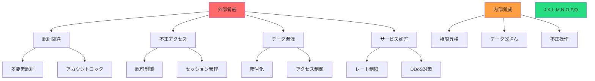

# セキュリティ設計

## 目的と概要

このドキュメントは、Nanika Gameプロジェクトの包括的なセキュリティ設計について詳述します。認証・認可システム、入力検証・サニタイゼーション、ファイルアップロード、セッション管理、CSRF・XSS対策など、ゲームアプリケーションに必要なセキュリティ要件を網羅し、セキュアなシステム構築を実現します。

## 現在の実装状況

- **基本認証システム**: bcryptによるパスワードハッシュ化、セッション管理
- **HTTPS強制**: 本番環境でのSSL/TLS暗号化
- **入力検証**: Zodライブラリによる基本的なバリデーション
- **SQLインジェクション対策**: Prisma ORMによる安全なクエリ実行
- **セッション管理**: HTTPOnlyクッキーによるセッショントークン管理

## セキュリティ脅威モデル

### 1. 脅威の分析と対策マップ



### 2. リスクレベル分類

```typescript
// app/shared/security/risk-assessment.ts

export const SecurityRiskLevel = {
  CRITICAL: 'critical',    // 即座の対応が必要
  HIGH: 'high',           // 24時間以内の対応
  MEDIUM: 'medium',       // 1週間以内の対応
  LOW: 'low'              // 計画的な対応
} as const;
export type SecurityRiskLevel = typeof SecurityRiskLevel[keyof typeof SecurityRiskLevel];

export interface SecurityThreat {
  readonly id: string;
  readonly name: string;
  readonly description: string;
  readonly riskLevel: SecurityRiskLevel;
  readonly impact: ThreatImpact;
  readonly likelihood: ThreatLikelihood;
  readonly mitigations: SecurityMitigation[];
}

export const ThreatImpact = {
  CATASTROPHIC: 'catastrophic', // システム全停止
  MAJOR: 'major',              // 重要機能停止
  MODERATE: 'moderate',        // 一部機能影響
  MINOR: 'minor'               // 限定的影響
} as const;
export type ThreatImpact = typeof ThreatImpact[keyof typeof ThreatImpact];

export const ThreatLikelihood = {
  VERY_HIGH: 'very_high',   // 90%以上
  HIGH: 'high',             // 70-90%
  MEDIUM: 'medium',         // 30-70%
  LOW: 'low',               // 10-30%
  VERY_LOW: 'very_low'      // 10%未満
} as const;
export type ThreatLikelihood = typeof ThreatLikelihood[keyof typeof ThreatLikelihood];

export interface SecurityMitigation {
  readonly strategy: string;
  readonly implementation: string;
  readonly effectiveness: 'high' | 'medium' | 'low';
  readonly cost: 'high' | 'medium' | 'low';
}
```

## 認証・認可システム

### 1. 多層認証アーキテクチャ

```typescript
// app/domain/auth/authentication.types.ts

export interface AuthenticationStrategy {
  readonly name: string;
  readonly priority: number;
  authenticate(credentials: AuthCredentials): Promise<AuthResult>;
  validateToken(token: string): Promise<TokenValidationResult>;
}

export interface AuthCredentials {
  readonly type: AuthenticationType;
  readonly data: Record<string, unknown>;
  readonly metadata?: AuthMetadata;
}

export const AuthenticationType = {
  PASSWORD: 'password',
  MFA_TOTP: 'mfa_totp',
  MFA_SMS: 'mfa_sms',
  OAUTH: 'oauth',
  API_KEY: 'api_key'
} as const;
export type AuthenticationType = typeof AuthenticationType[keyof typeof AuthenticationType];

export interface AuthMetadata {
  readonly ipAddress: string;
  readonly userAgent: string;
  readonly timestamp: Date;
  readonly geoLocation?: GeoLocation;
}

export interface GeoLocation {
  readonly country: string;
  readonly region: string;
  readonly city: string;
  readonly latitude: number;
  readonly longitude: number;
}

export interface AuthResult {
  readonly success: boolean;
  readonly user?: AuthenticatedUser;
  readonly sessionToken?: string;
  readonly expiresAt?: Date;
  readonly requiresMFA?: boolean;
  readonly error?: AuthError;
}

export interface AuthenticatedUser {
  readonly id: UserId;
  readonly email: string;
  readonly name: string;
  readonly roles: UserRole[];
  readonly permissions: Permission[];
  readonly lastLoginAt: Date;
  readonly mfaEnabled: boolean;
}

export const UserRole = {
  ADMIN: 'admin',
  MODERATOR: 'moderator',
  USER: 'user',
  GUEST: 'guest'
} as const;
export type UserRole = typeof UserRole[keyof typeof UserRole];

export interface Permission {
  readonly resource: string;
  readonly action: string;
  readonly conditions?: PermissionCondition[];
}

export interface PermissionCondition {
  readonly field: string;
  readonly operator: 'equals' | 'not_equals' | 'in' | 'not_in' | 'greater_than' | 'less_than';
  readonly value: unknown;
}
```

### 2. パスワードセキュリティ

```typescript
// app/domain/auth/password-security.ts
import bcrypt from 'bcryptjs';
import argon2 from 'argon2';

export class PasswordSecurity {
  private static readonly BCRYPT_ROUNDS = 12;
  private static readonly MIN_PASSWORD_LENGTH = 8;
  private static readonly MAX_PASSWORD_LENGTH = 128;
  
  // パスワード強度要件
  private static readonly PASSWORD_REQUIREMENTS = {
    minLength: 8,
    requireUppercase: true,
    requireLowercase: true,
    requireNumbers: true,
    requireSpecialChars: true,
    forbiddenPatterns: [
      /(.)\1{2,}/, // 同じ文字3回以上連続
      /123456|qwerty|password/i, // 一般的な弱いパスワード
    ],
  };

  static async hashPassword(password: string, algorithm: 'bcrypt' | 'argon2' = 'bcrypt'): Promise<PasswordHashResult> {
    await this.validatePasswordStrength(password);
    
    let hash: string;
    let saltRounds: number | undefined;
    
    switch (algorithm) {
      case 'bcrypt':
        saltRounds = this.BCRYPT_ROUNDS;
        hash = await bcrypt.hash(password, saltRounds);
        break;
        
      case 'argon2':
        hash = await argon2.hash(password, {
          type: argon2.argon2id,
          memoryCost: 2 ** 16,
          timeCost: 3,
          parallelism: 1,
        });
        break;
        
      default:
        throw new SecurityError('Unsupported password hashing algorithm');
    }
    
    return {
      hash,
      algorithm,
      saltRounds,
      createdAt: new Date(),
    };
  }

  static async verifyPassword(password: string, hashedPassword: string, algorithm: 'bcrypt' | 'argon2'): Promise<boolean> {
    try {
      switch (algorithm) {
        case 'bcrypt':
          return await bcrypt.compare(password, hashedPassword);
          
        case 'argon2':
          return await argon2.verify(hashedPassword, password);
          
        default:
          return false;
      }
    } catch {
      return false;
    }
  }

  static async validatePasswordStrength(password: string): Promise<void> {
    const issues: string[] = [];
    
    // 長さチェック
    if (password.length < this.PASSWORD_REQUIREMENTS.minLength) {
      issues.push(`パスワードは${this.PASSWORD_REQUIREMENTS.minLength}文字以上である必要があります`);
    }
    
    if (password.length > this.MAX_PASSWORD_LENGTH) {
      issues.push(`パスワードは${this.MAX_PASSWORD_LENGTH}文字以下である必要があります`);
    }
    
    // 文字種チェック
    if (this.PASSWORD_REQUIREMENTS.requireUppercase && !/[A-Z]/.test(password)) {
      issues.push('大文字を含む必要があります');
    }
    
    if (this.PASSWORD_REQUIREMENTS.requireLowercase && !/[a-z]/.test(password)) {
      issues.push('小文字を含む必要があります');
    }
    
    if (this.PASSWORD_REQUIREMENTS.requireNumbers && !/[0-9]/.test(password)) {
      issues.push('数字を含む必要があります');
    }
    
    if (this.PASSWORD_REQUIREMENTS.requireSpecialChars && !/[^A-Za-z0-9]/.test(password)) {
      issues.push('特殊文字を含む必要があります');
    }
    
    // 禁止パターンチェック
    for (const pattern of this.PASSWORD_REQUIREMENTS.forbiddenPatterns) {
      if (pattern.test(password)) {
        issues.push('使用できないパスワードパターンです');
        break;
      }
    }
    
    if (issues.length > 0) {
      throw new ValidationError('パスワード強度が不足しています', { issues });
    }
  }

  static generateSecurePassword(length = 16): string {
    const charset = 'ABCDEFGHIJKLMNOPQRSTUVWXYZabcdefghijklmnopqrstuvwxyz0123456789!@#$%^&*';
    let password = '';
    
    // 各文字種から最低1文字
    password += 'ABCDEFGHIJKLMNOPQRSTUVWXYZ'[Math.floor(Math.random() * 26)];
    password += 'abcdefghijklmnopqrstuvwxyz'[Math.floor(Math.random() * 26)];
    password += '0123456789'[Math.floor(Math.random() * 10)];
    password += '!@#$%^&*'[Math.floor(Math.random() * 8)];
    
    // 残りの文字をランダム生成
    for (let i = 4; i < length; i++) {
      password += charset[Math.floor(Math.random() * charset.length)];
    }
    
    // シャッフル
    return password.split('').sort(() => Math.random() - 0.5).join('');
  }
}

export interface PasswordHashResult {
  readonly hash: string;
  readonly algorithm: 'bcrypt' | 'argon2';
  readonly saltRounds?: number;
  readonly createdAt: Date;
}

export class SecurityError extends Error {
  constructor(message: string, public readonly code?: string) {
    super(message);
    this.name = 'SecurityError';
  }
}
```

### 3. 多要素認証（MFA）

```typescript
// app/domain/auth/mfa.service.ts
import * as speakeasy from 'speakeasy';
import * as qrcode from 'qrcode';

export class MFAService {
  private static readonly SERVICE_NAME = 'Nanika Game';
  private static readonly TOKEN_WINDOW = 1; // 30秒前後のトークンも受け入れ
  private static readonly BACKUP_CODES_COUNT = 8;

  static async generateTOTPSecret(userId: UserId, email: string): Promise<TOTPSetup> {
    const secret = speakeasy.generateSecret({
      name: email,
      issuer: this.SERVICE_NAME,
      length: 32
    });

    const otpauthUrl = speakeasy.otpauthURL({
      secret: secret.ascii,
      label: email,
      issuer: this.SERVICE_NAME,
      encoding: 'ascii'
    });

    const qrCodeDataUrl = await qrcode.toDataURL(otpauthUrl);
    
    const backupCodes = this.generateBackupCodes();

    return {
      secret: secret.base32,
      qrCodeUrl: qrCodeDataUrl,
      manualEntryKey: secret.base32,
      backupCodes
    };
  }

  static verifyTOTPToken(secret: string, token: string): boolean {
    return speakeasy.totp.verify({
      secret,
      encoding: 'base32',
      token,
      window: this.TOKEN_WINDOW
    });
  }

  static verifyBackupCode(storedCodes: string[], providedCode: string): { isValid: boolean; remainingCodes?: string[] } {
    const hashedProvidedCode = this.hashBackupCode(providedCode);
    const codeIndex = storedCodes.indexOf(hashedProvidedCode);
    
    if (codeIndex === -1) {
      return { isValid: false };
    }
    
    // 使用済みコードを削除
    const remainingCodes = [...storedCodes];
    remainingCodes.splice(codeIndex, 1);
    
    return {
      isValid: true,
      remainingCodes
    };
  }

  private static generateBackupCodes(): string[] {
    const codes: string[] = [];
    
    for (let i = 0; i < this.BACKUP_CODES_COUNT; i++) {
      // 8桁のランダムな数字コード
      const code = Math.random().toString().substring(2, 10);
      codes.push(code);
    }
    
    return codes;
  }

  private static hashBackupCode(code: string): string {
    const crypto = require('crypto');
    return crypto.createHash('sha256').update(code).digest('hex');
  }
}

export interface TOTPSetup {
  readonly secret: string;
  readonly qrCodeUrl: string;
  readonly manualEntryKey: string;
  readonly backupCodes: string[];
}
```

## セッション管理とトークンセキュリティ

### 1. 安全なセッション管理

```typescript
// app/domain/auth/session-manager.ts
import { randomBytes, createHash } from 'crypto';

export class SessionManager {
  private static readonly SESSION_LIFETIME = 24 * 60 * 60 * 1000; // 24時間
  private static readonly REFRESH_TOKEN_LIFETIME = 7 * 24 * 60 * 60 * 1000; // 7日
  private static readonly TOKEN_LENGTH = 32;
  
  static async createSession(userId: UserId, authMetadata: AuthMetadata): Promise<SessionData> {
    const sessionToken = this.generateSecureToken();
    const refreshToken = this.generateSecureToken();
    const expiresAt = new Date(Date.now() + this.SESSION_LIFETIME);
    const refreshExpiresAt = new Date(Date.now() + this.REFRESH_TOKEN_LIFETIME);
    
    // セッションをデータベースに保存
    const session: SessionEntity = {
      id: sessionToken as SessionId,
      userId,
      token: this.hashToken(sessionToken),
      refreshToken: this.hashToken(refreshToken),
      expiresAt,
      refreshExpiresAt,
      createdAt: new Date(),
      ipAddress: authMetadata.ipAddress,
      userAgent: authMetadata.userAgent,
      geoLocation: authMetadata.geoLocation,
      isActive: true,
      revokedAt: undefined
    };
    
    await this.saveSession(session);
    
    return {
      sessionToken,
      refreshToken,
      expiresAt,
      refreshExpiresAt
    };
  }

  static async validateSession(sessionToken: string): Promise<SessionValidationResult> {
    const hashedToken = this.hashToken(sessionToken);
    const session = await this.findSessionByToken(hashedToken);
    
    if (!session) {
      return { valid: false, error: 'Session not found' };
    }
    
    if (!session.isActive || session.revokedAt) {
      return { valid: false, error: 'Session revoked' };
    }
    
    if (session.expiresAt < new Date()) {
      await this.revokeSession(session.id);
      return { valid: false, error: 'Session expired' };
    }
    
    // セッションアクティビティを更新
    await this.updateSessionActivity(session.id);
    
    return {
      valid: true,
      session,
      user: await this.getUserById(session.userId)
    };
  }

  static async refreshSession(refreshToken: string): Promise<RefreshResult> {
    const hashedToken = this.hashToken(refreshToken);
    const session = await this.findSessionByRefreshToken(hashedToken);
    
    if (!session || session.refreshExpiresAt < new Date()) {
      return { success: false, error: 'Invalid refresh token' };
    }
    
    // 新しいセッショントークンを生成
    const newSessionToken = this.generateSecureToken();
    const newExpiresAt = new Date(Date.now() + this.SESSION_LIFETIME);
    
    await this.updateSession(session.id, {
      token: this.hashToken(newSessionToken),
      expiresAt: newExpiresAt,
      lastActivityAt: new Date()
    });
    
    return {
      success: true,
      sessionToken: newSessionToken,
      expiresAt: newExpiresAt
    };
  }

  static async revokeSession(sessionId: SessionId): Promise<void> {
    await this.updateSession(sessionId, {
      isActive: false,
      revokedAt: new Date()
    });
  }

  static async revokeAllUserSessions(userId: UserId, exceptSessionId?: SessionId): Promise<number> {
    const sessions = await this.findUserSessions(userId);
    let revokedCount = 0;
    
    for (const session of sessions) {
      if (session.id !== exceptSessionId && session.isActive) {
        await this.revokeSession(session.id);
        revokedCount++;
      }
    }
    
    return revokedCount;
  }

  private static generateSecureToken(): string {
    return randomBytes(this.TOKEN_LENGTH).toString('hex');
  }

  private static hashToken(token: string): string {
    return createHash('sha256').update(token).digest('hex');
  }

  // データベース操作メソッド（実装は省略）
  private static async saveSession(session: SessionEntity): Promise<void> { /* 実装 */ }
  private static async findSessionByToken(hashedToken: string): Promise<SessionEntity | null> { /* 実装 */ }
  private static async updateSessionActivity(sessionId: SessionId): Promise<void> { /* 実装 */ }
  private static async updateSession(sessionId: SessionId, updates: Partial<SessionEntity>): Promise<void> { /* 実装 */ }
  private static async findSessionByRefreshToken(hashedToken: string): Promise<SessionEntity | null> { /* 実装 */ }
  private static async findUserSessions(userId: UserId): Promise<SessionEntity[]> { /* 実装 */ }
  private static async getUserById(userId: UserId): Promise<AuthenticatedUser | null> { /* 実装 */ }
}

export interface SessionData {
  readonly sessionToken: string;
  readonly refreshToken: string;
  readonly expiresAt: Date;
  readonly refreshExpiresAt: Date;
}

export interface SessionValidationResult {
  readonly valid: boolean;
  readonly session?: SessionEntity;
  readonly user?: AuthenticatedUser;
  readonly error?: string;
}

export interface RefreshResult {
  readonly success: boolean;
  readonly sessionToken?: string;
  readonly expiresAt?: Date;
  readonly error?: string;
}

export interface SessionEntity {
  readonly id: SessionId;
  readonly userId: UserId;
  readonly token: string;
  readonly refreshToken: string;
  readonly expiresAt: Date;
  readonly refreshExpiresAt: Date;
  readonly createdAt: Date;
  readonly lastActivityAt?: Date;
  readonly ipAddress?: string;
  readonly userAgent?: string;
  readonly geoLocation?: GeoLocation;
  readonly isActive: boolean;
  readonly revokedAt?: Date;
}
```

### 2. JWTトークン管理（将来実装）

```typescript
// app/domain/auth/jwt-manager.ts
import jwt from 'jsonwebtoken';

export class JWTManager {
  private static readonly ACCESS_TOKEN_EXPIRES = '15m';
  private static readonly REFRESH_TOKEN_EXPIRES = '7d';
  private static readonly ALGORITHM = 'RS256';
  
  static generateTokenPair(user: AuthenticatedUser): TokenPair {
    const payload = {
      sub: user.id,
      email: user.email,
      name: user.name,
      roles: user.roles,
      iat: Math.floor(Date.now() / 1000)
    };
    
    const accessToken = jwt.sign(payload, this.getPrivateKey(), {
      expiresIn: this.ACCESS_TOKEN_EXPIRES,
      algorithm: this.ALGORITHM,
      issuer: 'nanika-game',
      audience: 'nanika-game-users'
    });
    
    const refreshToken = jwt.sign(
      { sub: user.id, type: 'refresh' },
      this.getPrivateKey(),
      {
        expiresIn: this.REFRESH_TOKEN_EXPIRES,
        algorithm: this.ALGORITHM,
        issuer: 'nanika-game'
      }
    );
    
    return { accessToken, refreshToken };
  }
  
  static verifyAccessToken(token: string): JWTPayload | null {
    try {
      const payload = jwt.verify(token, this.getPublicKey(), {
        algorithms: [this.ALGORITHM],
        issuer: 'nanika-game',
        audience: 'nanika-game-users'
      }) as JWTPayload;
      
      return payload;
    } catch {
      return null;
    }
  }
  
  static verifyRefreshToken(token: string): RefreshTokenPayload | null {
    try {
      const payload = jwt.verify(token, this.getPublicKey(), {
        algorithms: [this.ALGORITHM],
        issuer: 'nanika-game'
      }) as RefreshTokenPayload;
      
      if (payload.type !== 'refresh') {
        return null;
      }
      
      return payload;
    } catch {
      return null;
    }
  }
  
  private static getPrivateKey(): string {
    return process.env.JWT_PRIVATE_KEY || '';
  }
  
  private static getPublicKey(): string {
    return process.env.JWT_PUBLIC_KEY || '';
  }
}

export interface TokenPair {
  readonly accessToken: string;
  readonly refreshToken: string;
}

export interface JWTPayload {
  readonly sub: UserId;
  readonly email: string;
  readonly name: string;
  readonly roles: UserRole[];
  readonly iat: number;
  readonly exp: number;
  readonly iss: string;
  readonly aud: string;
}

export interface RefreshTokenPayload {
  readonly sub: UserId;
  readonly type: 'refresh';
  readonly iat: number;
  readonly exp: number;
  readonly iss: string;
}
```

## 入力検証・サニタイゼーション

### 1. 多層入力検証

```typescript
// app/shared/validation/input-sanitizer.ts
import DOMPurify from 'isomorphic-dompurify';
import { z } from 'zod';

export class InputSanitizer {
  // HTMLサニタイゼーション
  static sanitizeHTML(input: string, allowedTags?: string[]): string {
    const config = allowedTags ? {
      ALLOWED_TAGS: allowedTags,
      ALLOWED_ATTR: ['href', 'title', 'alt']
    } : {
      ALLOWED_TAGS: ['b', 'i', 'em', 'strong', 'a', 'br'],
      ALLOWED_ATTR: ['href', 'title']
    };
    
    return DOMPurify.sanitize(input, config);
  }

  // SQLインジェクション対策（Prismaで基本対策済み）
  static sanitizeSQL(input: string): string {
    // Prismaを使用している場合は基本的に不要だが、生クエリ時の保険
    return input.replace(/['"\\;]/g, '');
  }

  // XSS対策
  static escapeHTML(input: string): string {
    return input
      .replace(/&/g, '&amp;')
      .replace(/</g, '&lt;')
      .replace(/>/g, '&gt;')
      .replace(/"/g, '&quot;')
      .replace(/'/g, '&#39;');
  }

  // ファイル名サニタイゼーション
  static sanitizeFileName(fileName: string): string {
    return fileName
      .replace(/[^a-zA-Z0-9._-]/g, '')
      .replace(/\.{2,}/g, '.')
      .substring(0, 255);
  }

  // URLサニタイゼーション
  static sanitizeURL(url: string): string | null {
    try {
      const parsed = new URL(url);
      
      // 許可されたプロトコルのみ
      if (!['http:', 'https:'].includes(parsed.protocol)) {
        return null;
      }
      
      return parsed.toString();
    } catch {
      return null;
    }
  }

  // 数値検証
  static sanitizeNumber(input: unknown, min?: number, max?: number): number | null {
    const num = Number(input);
    
    if (isNaN(num) || !isFinite(num)) {
      return null;
    }
    
    if (min !== undefined && num < min) {
      return null;
    }
    
    if (max !== undefined && num > max) {
      return null;
    }
    
    return num;
  }

  // 文字列長制限
  static truncateString(input: string, maxLength: number): string {
    return input.length > maxLength ? input.substring(0, maxLength) : input;
  }
}

// 包括的入力検証スキーマ
export const SecureValidationSchemas = {
  // ユーザー入力
  UserName: z.string()
    .min(1, '名前は必須です')
    .max(50, '名前は50文字以下です')
    .regex(/^[a-zA-Z0-9\u3040-\u309F\u30A0-\u30FF\u4E00-\u9FAF\s]+$/, '無効な文字が含まれています')
    .transform(InputSanitizer.escapeHTML),

  Email: z.string()
    .email('有効なメールアドレスを入力してください')
    .max(255, 'メールアドレスが長すぎます')
    .toLowerCase()
    .transform(input => input.trim()),

  Password: z.string()
    .min(8, 'パスワードは8文字以上です')
    .max(128, 'パスワードは128文字以下です')
    .regex(/^(?=.*[a-z])(?=.*[A-Z])(?=.*\d)/, '大文字・小文字・数字を含む必要があります'),

  // ゲーム関連
  GameName: z.string()
    .min(1, 'ゲーム名は必須です')
    .max(100, 'ゲーム名は100文字以下です')
    .transform(InputSanitizer.sanitizeHTML),

  GameDescription: z.string()
    .max(1000, '説明は1000文字以下です')
    .transform(input => InputSanitizer.sanitizeHTML(input, ['b', 'i', 'br']))
    .optional(),

  // ファイルアップロード
  FileName: z.string()
    .max(255, 'ファイル名が長すぎます')
    .transform(InputSanitizer.sanitizeFileName),

  FileSize: z.number()
    .int('ファイルサイズは整数である必要があります')
    .min(1, 'ファイルサイズが無効です')
    .max(10 * 1024 * 1024, 'ファイルサイズは10MB以下である必要があります'), // 10MB

  // URL
  WebURL: z.string()
    .url('有効なURLを入力してください')
    .transform(InputSanitizer.sanitizeURL)
    .refine(url => url !== null, '無効なURLです'),
};
```

### 2. コンテンツセキュリティポリシー（CSP）

```typescript
// app/infrastructure/security/csp-middleware.ts
import type { Request, Response, NextFunction } from 'express';

export class CSPMiddleware {
  private static readonly CSP_DIRECTIVES = {
    'default-src': ["'self'"],
    'script-src': [
      "'self'",
      "'unsafe-inline'", // React の development モード用（本番では削除）
      'https://cdn.jsdelivr.net',
      'https://unpkg.com'
    ],
    'style-src': [
      "'self'",
      "'unsafe-inline'", // Tailwind CSS用
      'https://fonts.googleapis.com'
    ],
    'font-src': [
      "'self'",
      'https://fonts.gstatic.com'
    ],
    'img-src': [
      "'self'",
      'data:', // Base64画像用
      'https:', // 外部画像サービス
    ],
    'connect-src': [
      "'self'",
      'wss:', // WebSocket用
      'https:' // API接続用
    ],
    'media-src': ["'self'"],
    'object-src': ["'none'"],
    'frame-src': ["'none'"],
    'base-uri': ["'self'"],
    'form-action': ["'self'"],
    'frame-ancestors': ["'none'"],
    'upgrade-insecure-requests': []
  };

  static generateCSPHeader(isDevelopment = false): string {
    const directives = { ...this.CSP_DIRECTIVES };
    
    if (!isDevelopment) {
      // 本番環境では unsafe-inline を削除
      directives['script-src'] = directives['script-src'].filter(src => src !== "'unsafe-inline'");
    }
    
    return Object.entries(directives)
      .map(([key, values]) => `${key} ${values.join(' ')}`)
      .join('; ');
  }

  static middleware() {
    return (req: Request, res: Response, next: NextFunction) => {
      const cspHeader = this.generateCSPHeader(process.env.NODE_ENV === 'development');
      
      res.setHeader('Content-Security-Policy', cspHeader);
      res.setHeader('X-Content-Type-Options', 'nosniff');
      res.setHeader('X-Frame-Options', 'DENY');
      res.setHeader('X-XSS-Protection', '1; mode=block');
      res.setHeader('Referrer-Policy', 'strict-origin-when-cross-origin');
      res.setHeader('Permissions-Policy', 'geolocation=(), microphone=(), camera=()');
      
      if (process.env.NODE_ENV === 'production') {
        res.setHeader('Strict-Transport-Security', 'max-age=31536000; includeSubDomains; preload');
      }
      
      next();
    };
  }
}
```

## ファイルアップロード・セキュリティ

### 1. 安全なファイルアップロード

```typescript
// app/infrastructure/storage/secure-file-upload.ts
import multer from 'multer';
import { createHash } from 'crypto';
import sharp from 'sharp';
import path from 'path';

export class SecureFileUpload {
  private static readonly ALLOWED_MIME_TYPES = new Map([
    // 画像ファイル
    ['image/jpeg', ['.jpg', '.jpeg']],
    ['image/png', ['.png']],
    ['image/gif', ['.gif']],
    ['image/webp', ['.webp']],
    
    // ドキュメント（将来使用）
    ['application/pdf', ['.pdf']],
    ['text/plain', ['.txt']],
  ]);

  private static readonly MAX_FILE_SIZE = 10 * 1024 * 1024; // 10MB
  private static readonly MAX_FILES_PER_REQUEST = 5;

  static createUploadMiddleware() {
    const storage = multer.diskStorage({
      destination: (req, file, cb) => {
        const uploadDir = path.join(process.cwd(), 'uploads', 'temp');
        cb(null, uploadDir);
      },
      filename: (req, file, cb) => {
        // セキュアなファイル名生成
        const fileExtension = path.extname(file.originalname).toLowerCase();
        const timestamp = Date.now();
        const randomString = createHash('sha256')
          .update(`${file.originalname}-${timestamp}-${Math.random()}`)
          .digest('hex')
          .substring(0, 16);
        
        cb(null, `${timestamp}-${randomString}${fileExtension}`);
      }
    });

    return multer({
      storage,
      limits: {
        fileSize: this.MAX_FILE_SIZE,
        files: this.MAX_FILES_PER_REQUEST,
      },
      fileFilter: this.fileFilter.bind(this),
    });
  }

  private static fileFilter(req: any, file: Express.Multer.File, cb: multer.FileFilterCallback) {
    // MIMEタイプ検証
    const isAllowedMime = this.ALLOWED_MIME_TYPES.has(file.mimetype);
    if (!isAllowedMime) {
      return cb(new Error(`許可されていないファイル形式です: ${file.mimetype}`));
    }

    // ファイル拡張子検証
    const allowedExtensions = this.ALLOWED_MIME_TYPES.get(file.mimetype) || [];
    const fileExtension = path.extname(file.originalname).toLowerCase();
    const isAllowedExtension = allowedExtensions.includes(fileExtension);
    
    if (!isAllowedExtension) {
      return cb(new Error(`許可されていないファイル拡張子です: ${fileExtension}`));
    }

    // ファイル名検証（危険な文字の排除）
    const sanitizedFileName = InputSanitizer.sanitizeFileName(file.originalname);
    if (sanitizedFileName !== file.originalname) {
      return cb(new Error('無効な文字がファイル名に含まれています'));
    }

    cb(null, true);
  }

  static async processUploadedFile(file: Express.Multer.File, userId: UserId): Promise<ProcessedFile> {
    try {
      // ファイルの詳細検証
      await this.validateFileContent(file);
      
      // 画像の場合はリサイズ・最適化
      let processedPath = file.path;
      if (file.mimetype.startsWith('image/')) {
        processedPath = await this.optimizeImage(file);
      }
      
      // 最終保存場所に移動
      const finalPath = await this.moveToFinalDestination(processedPath, userId);
      
      return {
        originalName: file.originalname,
        fileName: path.basename(finalPath),
        filePath: finalPath,
        mimeType: file.mimetype,
        size: file.size,
        uploadedBy: userId,
        uploadedAt: new Date(),
      };
      
    } catch (error) {
      // テンポラリファイルを削除
      await this.cleanupTempFile(file.path);
      throw error;
    }
  }

  private static async validateFileContent(file: Express.Multer.File): Promise<void> {
    const fs = require('fs').promises;
    
    // ファイルが空でないことを確認
    const stats = await fs.stat(file.path);
    if (stats.size === 0) {
      throw new Error('空のファイルはアップロードできません');
    }

    // マジックナンバーによるファイル形式検証（画像の場合）
    if (file.mimetype.startsWith('image/')) {
      const buffer = await fs.readFile(file.path, { flag: 'r' });
      const header = buffer.subarray(0, 12);
      
      if (!this.isValidImageHeader(header, file.mimetype)) {
        throw new Error('ファイルの形式が一致しません');
      }
    }
  }

  private static isValidImageHeader(header: Buffer, mimeType: string): boolean {
    switch (mimeType) {
      case 'image/jpeg':
        return header[0] === 0xFF && header[1] === 0xD8;
      case 'image/png':
        return header[0] === 0x89 && header[1] === 0x50 && header[2] === 0x4E && header[3] === 0x47;
      case 'image/gif':
        return header.subarray(0, 3).toString() === 'GIF';
      case 'image/webp':
        return header.subarray(0, 4).toString() === 'RIFF' && header.subarray(8, 12).toString() === 'WEBP';
      default:
        return false;
    }
  }

  private static async optimizeImage(file: Express.Multer.File): Promise<string> {
    const outputPath = file.path.replace(path.extname(file.path), '_optimized.webp');
    
    await sharp(file.path)
      .resize(1920, 1080, { 
        fit: 'inside', 
        withoutEnlargement: true 
      })
      .webp({ 
        quality: 85,
        effort: 4 
      })
      .toFile(outputPath);
    
    // 元ファイルを削除
    await this.cleanupTempFile(file.path);
    
    return outputPath;
  }

  private static async moveToFinalDestination(tempPath: string, userId: UserId): Promise<string> {
    const fs = require('fs').promises;
    const finalDir = path.join(process.cwd(), 'uploads', 'users', userId.toString());
    const fileName = path.basename(tempPath);
    const finalPath = path.join(finalDir, fileName);
    
    // ディレクトリ作成
    await fs.mkdir(finalDir, { recursive: true });
    
    // ファイル移動
    await fs.rename(tempPath, finalPath);
    
    return finalPath;
  }

  private static async cleanupTempFile(filePath: string): Promise<void> {
    try {
      const fs = require('fs').promises;
      await fs.unlink(filePath);
    } catch {
      // ファイルが存在しない場合は無視
    }
  }
}

export interface ProcessedFile {
  readonly originalName: string;
  readonly fileName: string;
  readonly filePath: string;
  readonly mimeType: string;
  readonly size: number;
  readonly uploadedBy: UserId;
  readonly uploadedAt: Date;
}
```

### 2. ウイルススキャン統合

```typescript
// app/infrastructure/security/virus-scanner.ts

export class VirusScanner {
  private static readonly CLAMAV_HOST = process.env.CLAMAV_HOST || 'localhost';
  private static readonly CLAMAV_PORT = parseInt(process.env.CLAMAV_PORT || '3310');
  private static readonly SCAN_TIMEOUT = 30000; // 30秒

  static async scanFile(filePath: string): Promise<ScanResult> {
    try {
      // ClamAV との連携
      const result = await this.performClamAVScan(filePath);
      
      if (result.infected) {
        // 感染ファイルを隔離
        await this.quarantineFile(filePath);
        
        // セキュリティログに記録
        await this.logSecurityIncident('VIRUS_DETECTED', {
          filePath,
          virusName: result.virusName,
          scanTime: new Date()
        });
      }
      
      return result;
      
    } catch (error) {
      // スキャンエラーの場合はファイルを拒否
      return {
        infected: true,
        virusName: 'SCAN_ERROR',
        error: error instanceof Error ? error.message : 'Unknown error'
      };
    }
  }

  private static async performClamAVScan(filePath: string): Promise<ScanResult> {
    return new Promise((resolve, reject) => {
      const net = require('net');
      const fs = require('fs');
      
      const socket = net.createConnection(this.CLAMAV_PORT, this.CLAMAV_HOST);
      
      socket.setTimeout(this.SCAN_TIMEOUT);
      
      socket.on('connect', () => {
        // INSTREAM コマンドでファイルをスキャン
        socket.write('zINSTREAM\0');
        
        const fileStream = fs.createReadStream(filePath);
        
        fileStream.on('data', (chunk) => {
          const size = Buffer.allocUnsafe(4);
          size.writeUInt32BE(chunk.length, 0);
          socket.write(size);
          socket.write(chunk);
        });
        
        fileStream.on('end', () => {
          const endChunk = Buffer.allocUnsafe(4);
          endChunk.writeUInt32BE(0, 0);
          socket.write(endChunk);
        });
      });
      
      socket.on('data', (data) => {
        const response = data.toString().trim();
        
        if (response === 'stream: OK') {
          resolve({ infected: false });
        } else if (response.includes('FOUND')) {
          const virusName = response.split(' ')[1];
          resolve({ infected: true, virusName });
        } else {
          reject(new Error(`Unexpected ClamAV response: ${response}`));
        }
        
        socket.end();
      });
      
      socket.on('error', reject);
      socket.on('timeout', () => reject(new Error('ClamAV scan timeout')));
    });
  }

  private static async quarantineFile(filePath: string): Promise<void> {
    const fs = require('fs').promises;
    const path = require('path');
    
    const quarantineDir = path.join(process.cwd(), 'quarantine');
    const fileName = path.basename(filePath);
    const quarantinePath = path.join(quarantineDir, `${Date.now()}-${fileName}`);
    
    await fs.mkdir(quarantineDir, { recursive: true });
    await fs.rename(filePath, quarantinePath);
  }

  private static async logSecurityIncident(type: string, details: Record<string, unknown>): Promise<void> {
    // セキュリティログシステムに記録
    const logEntry = {
      timestamp: new Date(),
      type,
      severity: 'HIGH',
      details
    };
    
    // 実際の実装では適切なログシステムに送信
    console.error('SECURITY INCIDENT:', logEntry);
  }
}

export interface ScanResult {
  readonly infected: boolean;
  readonly virusName?: string;
  readonly error?: string;
}
```

## CSRF・XSS攻撃対策

### 1. CSRF保護

```typescript
// app/infrastructure/security/csrf-protection.ts
import { createHash, randomBytes } from 'crypto';

export class CSRFProtection {
  private static readonly TOKEN_LENGTH = 32;
  private static readonly TOKEN_LIFETIME = 60 * 60 * 1000; // 1時間
  
  static generateCSRFToken(sessionId: string): CSRFToken {
    const token = randomBytes(this.TOKEN_LENGTH).toString('hex');
    const timestamp = Date.now();
    const signature = this.signToken(token, sessionId, timestamp);
    
    return {
      token,
      timestamp,
      signature
    };
  }

  static validateCSRFToken(token: string, sessionId: string, signature: string, timestamp: number): boolean {
    // トークンの有効期限チェック
    if (Date.now() - timestamp > this.TOKEN_LIFETIME) {
      return false;
    }

    // 署名検証
    const expectedSignature = this.signToken(token, sessionId, timestamp);
    return this.constantTimeCompare(signature, expectedSignature);
  }

  private static signToken(token: string, sessionId: string, timestamp: number): string {
    const secret = process.env.CSRF_SECRET || 'default-csrf-secret';
    const data = `${token}:${sessionId}:${timestamp}`;
    
    return createHash('hmac-sha256')
      .update(data)
      .update(secret)
      .digest('hex');
  }

  private static constantTimeCompare(a: string, b: string): boolean {
    if (a.length !== b.length) {
      return false;
    }

    let result = 0;
    for (let i = 0; i < a.length; i++) {
      result |= a.charCodeAt(i) ^ b.charCodeAt(i);
    }

    return result === 0;
  }

  // React Router用のCSRF検証ミドルウェア
  static createCSRFMiddleware() {
    return async (request: Request) => {
      // GET、HEAD、OPTIONS は CSRF チェックを除外
      if (['GET', 'HEAD', 'OPTIONS'].includes(request.method)) {
        return;
      }

      const sessionId = await this.getSessionIdFromRequest(request);
      if (!sessionId) {
        throw new Error('セッションが見つかりません');
      }

      const csrfToken = request.headers.get('X-CSRF-Token') || 
                       (await request.formData()).get('_csrf') as string;
      
      if (!csrfToken) {
        throw new Error('CSRFトークンが見つかりません');
      }

      const [token, timestampStr, signature] = csrfToken.split(':');
      const timestamp = parseInt(timestampStr);

      if (!this.validateCSRFToken(token, sessionId, signature, timestamp)) {
        throw new Error('CSRFトークンが無効です');
      }
    };
  }

  private static async getSessionIdFromRequest(request: Request): Promise<string | null> {
    // Cookie からセッション ID を取得
    const cookieHeader = request.headers.get('cookie');
    if (!cookieHeader) return null;

    const sessionCookie = cookieHeader
      .split(';')
      .find(cookie => cookie.trim().startsWith('session='));

    return sessionCookie ? sessionCookie.split('=')[1] : null;
  }
}

export interface CSRFToken {
  readonly token: string;
  readonly timestamp: number;
  readonly signature: string;
}
```

### 2. XSS保護強化

```typescript
// app/shared/security/xss-protection.ts

export class XSSProtection {
  // サニタイゼーション設定
  private static readonly SANITIZE_CONFIG = {
    ALLOWED_TAGS: ['b', 'i', 'em', 'strong', 'u', 'br', 'p', 'a'],
    ALLOWED_ATTR: {
      'a': ['href', 'title'],
    },
    ALLOW_DATA_ATTR: false,
    FORBID_TAGS: ['script', 'object', 'embed', 'form', 'input'],
    FORBID_ATTR: ['onerror', 'onload', 'onclick', 'onmouseover']
  };

  // ユーザー生成コンテンツのサニタイゼーション
  static sanitizeUserContent(content: string, allowHTML = false): string {
    if (!allowHTML) {
      return this.escapeHTML(content);
    }

    // HTML許可の場合は DOMPurify を使用
    const DOMPurify = require('isomorphic-dompurify');
    return DOMPurify.sanitize(content, this.SANITIZE_CONFIG);
  }

  // HTML エスケープ
  private static escapeHTML(input: string): string {
    const escapeMap: Record<string, string> = {
      '&': '&amp;',
      '<': '&lt;',
      '>': '&gt;',
      '"': '&quot;',
      "'": '&#39;',
      '/': '&#x2F;',
      '`': '&#x60;',
      '=': '&#x3D;'
    };

    return input.replace(/[&<>"'`=/]/g, char => escapeMap[char]);
  }

  // URL の検証とサニタイゼーション
  static sanitizeURL(url: string): string | null {
    try {
      const parsed = new URL(url);
      
      // 危険なプロトコルを拒否
      const allowedProtocols = ['http:', 'https:', 'mailto:'];
      if (!allowedProtocols.includes(parsed.protocol)) {
        return null;
      }

      // JavaScript URI を拒否
      if (url.toLowerCase().includes('javascript:') || url.toLowerCase().includes('data:')) {
        return null;
      }

      return parsed.toString();
    } catch {
      return null;
    }
  }

  // JSON レスポンスの XSS 対策
  static sanitizeJSONResponse(data: any): any {
    if (typeof data === 'string') {
      return this.escapeHTML(data);
    }
    
    if (Array.isArray(data)) {
      return data.map(item => this.sanitizeJSONResponse(item));
    }
    
    if (data && typeof data === 'object') {
      const sanitized: any = {};
      for (const [key, value] of Object.entries(data)) {
        sanitized[key] = this.sanitizeJSONResponse(value);
      }
      return sanitized;
    }
    
    return data;
  }

  // React コンポーネント用の安全なProps
  static createSafeProps(props: Record<string, any>): Record<string, any> {
    const safeProps: Record<string, any> = {};
    
    for (const [key, value] of Object.entries(props)) {
      // イベントハンドラーは除外
      if (key.startsWith('on') && typeof value === 'function') {
        continue;
      }
      
      // 危険なプロパティを除外
      if (['dangerouslySetInnerHTML', 'innerHTML'].includes(key)) {
        continue;
      }
      
      safeProps[key] = typeof value === 'string' ? this.escapeHTML(value) : value;
    }
    
    return safeProps;
  }
}
```

## レート制限・DDoS対策

### 1. 適応的レート制限

```typescript
// app/infrastructure/security/rate-limiter.ts
import { Redis } from 'ioredis';

export class AdaptiveRateLimiter {
  private redis: Redis;
  
  constructor() {
    this.redis = new Redis(process.env.REDIS_URL || 'redis://localhost:6379');
  }
  
  // 基本的なレート制限
  async checkRateLimit(identifier: string, action: string): Promise<RateLimitResult> {
    const config = this.getRateLimitConfig(action);
    const key = `rate_limit:${action}:${identifier}`;
    
    const current = await this.redis.incr(key);
    
    if (current === 1) {
      await this.redis.expire(key, config.windowSeconds);
    }
    
    const isAllowed = current <= config.maxRequests;
    const remaining = Math.max(0, config.maxRequests - current);
    const resetTime = await this.redis.ttl(key);
    
    return {
      allowed: isAllowed,
      remaining,
      resetTime,
      limit: config.maxRequests
    };
  }

  // IP ベースのレート制限
  async checkIPRateLimit(ip: string, action: string): Promise<RateLimitResult> {
    // 疑わしいIPの場合はより厳しい制限
    const isSuspicious = await this.isSuspiciousIP(ip);
    const multiplier = isSuspicious ? 0.1 : 1; // 疑わしいIPは制限を10倍厳しくする
    
    const config = this.getRateLimitConfig(action);
    const adjustedConfig = {
      ...config,
      maxRequests: Math.floor(config.maxRequests * multiplier)
    };
    
    return this.checkRateLimitWithConfig(ip, action, adjustedConfig);
  }

  // ユーザーベースのレート制限
  async checkUserRateLimit(userId: UserId, action: string): Promise<RateLimitResult> {
    const userTier = await this.getUserTier(userId);
    const config = this.getRateLimitConfig(action, userTier);
    
    return this.checkRateLimitWithConfig(userId.toString(), action, config);
  }

  // 段階的制限（徐々に制限を強化）
  async checkProgressiveRateLimit(identifier: string, action: string): Promise<RateLimitResult> {
    const violationCount = await this.getViolationCount(identifier, action);
    const config = this.getRateLimitConfig(action);
    
    // 違反回数に応じて制限を強化
    const penaltyMultiplier = Math.max(0.1, 1 - (violationCount * 0.2));
    const adjustedConfig = {
      ...config,
      maxRequests: Math.floor(config.maxRequests * penaltyMultiplier)
    };
    
    const result = await this.checkRateLimitWithConfig(identifier, action, adjustedConfig);
    
    // 制限に違反した場合は違反カウントを増加
    if (!result.allowed) {
      await this.incrementViolationCount(identifier, action);
    }
    
    return result;
  }

  private async checkRateLimitWithConfig(
    identifier: string, 
    action: string, 
    config: RateLimitConfig
  ): Promise<RateLimitResult> {
    const key = `rate_limit:${action}:${identifier}`;
    
    // Sliding Window Log アルゴリズム
    const now = Date.now();
    const windowStart = now - (config.windowSeconds * 1000);
    
    // 古いエントリを削除
    await this.redis.zremrangebyscore(key, '-inf', windowStart);
    
    // 現在のリクエスト数を取得
    const current = await this.redis.zcard(key);
    
    if (current >= config.maxRequests) {
      return {
        allowed: false,
        remaining: 0,
        resetTime: config.windowSeconds,
        limit: config.maxRequests
      };
    }
    
    // 新しいリクエストを記録
    await this.redis.zadd(key, now, `${now}-${Math.random()}`);
    await this.redis.expire(key, config.windowSeconds * 2); // 安全のため長めに設定
    
    return {
      allowed: true,
      remaining: config.maxRequests - current - 1,
      resetTime: config.windowSeconds,
      limit: config.maxRequests
    };
  }

  private getRateLimitConfig(action: string, userTier?: UserTier): RateLimitConfig {
    const baseConfigs: Record<string, RateLimitConfig> = {
      'auth.login': { maxRequests: 5, windowSeconds: 300 }, // 5回/5分
      'auth.register': { maxRequests: 3, windowSeconds: 3600 }, // 3回/1時間
      'game.create': { maxRequests: 10, windowSeconds: 60 }, // 10回/1分
      'game.join': { maxRequests: 50, windowSeconds: 60 }, // 50回/1分
      'api.general': { maxRequests: 100, windowSeconds: 60 }, // 100回/1分
      'upload.file': { maxRequests: 20, windowSeconds: 3600 }, // 20回/1時間
    };
    
    const config = baseConfigs[action] || baseConfigs['api.general'];
    
    // ユーザーティアに基づく調整
    if (userTier) {
      const multipliers: Record<UserTier, number> = {
        'premium': 2.0,
        'standard': 1.0,
        'basic': 0.5,
        'restricted': 0.1
      };
      
      const multiplier = multipliers[userTier] || 1.0;
      return {
        ...config,
        maxRequests: Math.floor(config.maxRequests * multiplier)
      };
    }
    
    return config;
  }

  private async isSuspiciousIP(ip: string): Promise<boolean> {
    // 既知の悪意のあるIPリストとの照合
    const suspiciousIPs = await this.redis.sismember('suspicious_ips', ip);
    if (suspiciousIPs) return true;
    
    // 短期間での大量アクセスを検出
    const recentRequests = await this.redis.zcard(`requests:${ip}`);
    if (recentRequests > 1000) return true; // 1000リクエスト/時間
    
    return false;
  }

  private async getUserTier(userId: UserId): Promise<UserTier> {
    // ユーザーの権限レベルを取得
    // 実装は省略
    return 'standard';
  }

  private async getViolationCount(identifier: string, action: string): Promise<number> {
    const key = `violations:${action}:${identifier}`;
    const count = await this.redis.get(key);
    return count ? parseInt(count) : 0;
  }

  private async incrementViolationCount(identifier: string, action: string): Promise<void> {
    const key = `violations:${action}:${identifier}`;
    await this.redis.incr(key);
    await this.redis.expire(key, 24 * 60 * 60); // 24時間で期限切れ
  }
}

export interface RateLimitResult {
  readonly allowed: boolean;
  readonly remaining: number;
  readonly resetTime: number;
  readonly limit: number;
}

export interface RateLimitConfig {
  readonly maxRequests: number;
  readonly windowSeconds: number;
}

export type UserTier = 'premium' | 'standard' | 'basic' | 'restricted';
```

### 2. DDoS対策とトラフィック監視

```typescript
// app/infrastructure/security/ddos-protection.ts

export class DDoSProtection {
  private redis: Redis;
  private readonly ANALYSIS_WINDOW = 60; // 1分
  private readonly ALERT_THRESHOLDS = {
    requestsPerSecond: 100,
    uniqueIPs: 1000,
    errorRate: 0.5, // 50%
    averageResponseTime: 5000 // 5秒
  };

  constructor() {
    this.redis = new Redis(process.env.REDIS_URL || 'redis://localhost:6379');
  }

  async analyzeTrafficPattern(req: Request): Promise<ThreatAssessment> {
    const ip = this.getClientIP(req);
    const timestamp = Date.now();
    const endpoint = req.url;
    
    // トラフィックデータを記録
    await this.recordTrafficData(ip, endpoint, timestamp);
    
    // パターン分析
    const patterns = await Promise.all([
      this.detectVolumeAttack(),
      this.detectDistributedAttack(),
      this.detectSlowLoris(),
      this.detectApplicationLayerAttack(endpoint),
    ]);
    
    const threatLevel = this.calculateThreatLevel(patterns);
    
    if (threatLevel >= 0.7) {
      await this.triggerDefenseResponse(ip, threatLevel, patterns);
    }
    
    return {
      ip,
      threatLevel,
      patterns,
      action: this.determineAction(threatLevel),
      timestamp
    };
  }

  private async detectVolumeAttack(): Promise<ThreatPattern> {
    const key = `traffic:volume:${Math.floor(Date.now() / 1000 / this.ANALYSIS_WINDOW)}`;
    const requestCount = await this.redis.incr(key);
    await this.redis.expire(key, this.ANALYSIS_WINDOW * 2);
    
    const requestsPerSecond = requestCount / this.ANALYSIS_WINDOW;
    const severity = Math.min(1.0, requestsPerSecond / this.ALERT_THRESHOLDS.requestsPerSecond);
    
    return {
      name: 'volume_attack',
      severity,
      description: `${requestsPerSecond.toFixed(2)} requests/sec`,
      indicators: { requestsPerSecond }
    };
  }

  private async detectDistributedAttack(): Promise<ThreatPattern> {
    const key = `traffic:unique_ips:${Math.floor(Date.now() / 1000 / this.ANALYSIS_WINDOW)}`;
    const uniqueIPs = await this.redis.scard(key);
    
    const severity = Math.min(1.0, uniqueIPs / this.ALERT_THRESHOLDS.uniqueIPs);
    
    return {
      name: 'distributed_attack',
      severity,
      description: `${uniqueIPs} unique IPs`,
      indicators: { uniqueIPs }
    };
  }

  private async detectSlowLoris(): Promise<ThreatPattern> {
    // 接続時間が長いIPを検出
    const slowConnections = await this.redis.zrangebyscore(
      'slow_connections',
      Date.now() - (10 * 60 * 1000), // 10分前から
      '+inf'
    );
    
    const severity = Math.min(1.0, slowConnections.length / 100);
    
    return {
      name: 'slow_loris',
      severity,
      description: `${slowConnections.length} slow connections`,
      indicators: { slowConnections: slowConnections.length }
    };
  }

  private async detectApplicationLayerAttack(endpoint: string): Promise<ThreatPattern> {
    // 特定エンドポイントへの集中攻撃を検出
    const key = `endpoint_hits:${endpoint}:${Math.floor(Date.now() / 1000 / 60)}`;
    const hits = await this.redis.incr(key);
    await this.redis.expire(key, 120);
    
    // エンドポイント別の正常範囲を定義
    const normalRange = this.getNormalHitRange(endpoint);
    const severity = Math.min(1.0, Math.max(0, (hits - normalRange.max) / normalRange.max));
    
    return {
      name: 'application_layer_attack',
      severity,
      description: `${hits} hits on ${endpoint}`,
      indicators: { hits, endpoint }
    };
  }

  private calculateThreatLevel(patterns: ThreatPattern[]): number {
    // 重み付き平均で脅威レベルを算出
    const weights = {
      volume_attack: 0.4,
      distributed_attack: 0.3,
      slow_loris: 0.2,
      application_layer_attack: 0.1
    };
    
    return patterns.reduce((total, pattern) => {
      const weight = weights[pattern.name as keyof typeof weights] || 0.1;
      return total + (pattern.severity * weight);
    }, 0);
  }

  private async triggerDefenseResponse(ip: string, threatLevel: number, patterns: ThreatPattern[]): Promise<void> {
    const response: DefenseResponse = {
      timestamp: new Date(),
      ip,
      threatLevel,
      patterns,
      actions: []
    };
    
    if (threatLevel >= 0.9) {
      // 重大な脅威：即座にブロック
      await this.blockIP(ip, 60 * 60); // 1時間ブロック
      response.actions.push('BLOCK_IP');
    } else if (threatLevel >= 0.7) {
      // 中程度の脅威：制限強化
      await this.applyStrictRateLimit(ip);
      response.actions.push('STRICT_RATE_LIMIT');
    }
    
    // アラート送信
    await this.sendSecurityAlert(response);
    
    // ログ記録
    await this.logSecurityEvent(response);
  }

  private determineAction(threatLevel: number): DefenseAction {
    if (threatLevel >= 0.9) return 'BLOCK';
    if (threatLevel >= 0.7) return 'RESTRICT';
    if (threatLevel >= 0.4) return 'MONITOR';
    return 'ALLOW';
  }

  private async blockIP(ip: string, durationSeconds: number): Promise<void> {
    const key = `blocked_ips:${ip}`;
    await this.redis.setex(key, durationSeconds, '1');
    
    // ブロックログ
    await this.redis.zadd('block_log', Date.now(), JSON.stringify({
      ip,
      blockedAt: new Date(),
      duration: durationSeconds
    }));
  }

  private async applyStrictRateLimit(ip: string): Promise<void> {
    const key = `strict_limit:${ip}`;
    await this.redis.setex(key, 3600, '1'); // 1時間
  }

  private getNormalHitRange(endpoint: string): { min: number; max: number } {
    const ranges: Record<string, { min: number; max: number }> = {
      '/api/auth/login': { min: 0, max: 10 },
      '/api/games': { min: 0, max: 50 },
      '/api/users': { min: 0, max: 20 },
      '/': { min: 0, max: 100 }
    };
    
    return ranges[endpoint] || { min: 0, max: 30 };
  }

  private getClientIP(req: Request): string {
    const forwarded = req.headers.get('x-forwarded-for');
    if (forwarded) {
      return forwarded.split(',')[0].trim();
    }
    
    return req.headers.get('x-real-ip') || 'unknown';
  }

  private async recordTrafficData(ip: string, endpoint: string, timestamp: number): Promise<void> {
    const minute = Math.floor(timestamp / 1000 / 60);
    
    // IP別統計
    await this.redis.sadd(`traffic:unique_ips:${minute}`, ip);
    
    // エンドポイント別統計
    await this.redis.incr(`endpoint_hits:${endpoint}:${minute}`);
    
    // 全体統計
    await this.redis.incr(`traffic:volume:${minute}`);
    
    // データの有効期限設定（24時間）
    await this.redis.expire(`traffic:unique_ips:${minute}`, 24 * 60 * 60);
    await this.redis.expire(`endpoint_hits:${endpoint}:${minute}`, 24 * 60 * 60);
    await this.redis.expire(`traffic:volume:${minute}`, 24 * 60 * 60);
  }

  private async sendSecurityAlert(response: DefenseResponse): Promise<void> {
    // Slack、メール等への通知実装
    console.error('SECURITY ALERT:', response);
  }

  private async logSecurityEvent(response: DefenseResponse): Promise<void> {
    await this.redis.lpush('security_events', JSON.stringify(response));
    await this.redis.ltrim('security_events', 0, 1000); // 最新1000件を保持
  }
}

export interface ThreatAssessment {
  readonly ip: string;
  readonly threatLevel: number;
  readonly patterns: ThreatPattern[];
  readonly action: DefenseAction;
  readonly timestamp: number;
}

export interface ThreatPattern {
  readonly name: string;
  readonly severity: number;
  readonly description: string;
  readonly indicators: Record<string, unknown>;
}

export interface DefenseResponse {
  readonly timestamp: Date;
  readonly ip: string;
  readonly threatLevel: number;
  readonly patterns: ThreatPattern[];
  readonly actions: string[];
}

export type DefenseAction = 'BLOCK' | 'RESTRICT' | 'MONITOR' | 'ALLOW';
```

## セキュリティ監査・ログ管理

### 1. 包括的セキュリティログ

```typescript
// app/infrastructure/security/security-logger.ts

export class SecurityLogger {
  private static readonly LOG_LEVELS = {
    DEBUG: 0,
    INFO: 1,
    WARN: 2,
    ERROR: 3,
    CRITICAL: 4
  };

  static async logSecurityEvent(event: SecurityEvent): Promise<void> {
    const logEntry: SecurityLogEntry = {
      id: this.generateLogId(),
      timestamp: new Date(),
      level: event.level,
      category: event.category,
      event: event.event,
      userId: event.userId,
      sessionId: event.sessionId,
      ipAddress: event.ipAddress,
      userAgent: event.userAgent,
      details: event.details,
      riskScore: event.riskScore,
      severity: this.calculateSeverity(event)
    };

    // 複数の出力先に並行でログ出力
    await Promise.all([
      this.writeToFile(logEntry),
      this.writeToDatabase(logEntry),
      this.sendToSIEM(logEntry),
      this.checkAlertConditions(logEntry)
    ]);
  }

  // 認証イベント
  static async logAuthenticationEvent(
    type: 'LOGIN_SUCCESS' | 'LOGIN_FAILURE' | 'LOGOUT' | 'PASSWORD_CHANGE',
    userId?: UserId,
    details?: Record<string, unknown>
  ): Promise<void> {
    await this.logSecurityEvent({
      level: type.includes('FAILURE') ? 'WARN' : 'INFO',
      category: 'AUTHENTICATION',
      event: type,
      userId,
      details,
      riskScore: type.includes('FAILURE') ? 0.6 : 0.1
    });
  }

  // 認可イベント
  static async logAuthorizationEvent(
    type: 'ACCESS_GRANTED' | 'ACCESS_DENIED' | 'PRIVILEGE_ESCALATION',
    userId: UserId,
    resource: string,
    action: string,
    details?: Record<string, unknown>
  ): Promise<void> {
    await this.logSecurityEvent({
      level: type === 'ACCESS_DENIED' ? 'WARN' : 'INFO',
      category: 'AUTHORIZATION',
      event: type,
      userId,
      details: {
        resource,
        action,
        ...details
      },
      riskScore: type === 'PRIVILEGE_ESCALATION' ? 0.8 : 0.2
    });
  }

  // データアクセスイベント
  static async logDataAccessEvent(
    type: 'DATA_READ' | 'DATA_WRITE' | 'DATA_DELETE' | 'DATA_EXPORT',
    userId: UserId,
    dataType: string,
    recordId?: string,
    details?: Record<string, unknown>
  ): Promise<void> {
    await this.logSecurityEvent({
      level: type === 'DATA_DELETE' ? 'WARN' : 'INFO',
      category: 'DATA_ACCESS',
      event: type,
      userId,
      details: {
        dataType,
        recordId,
        ...details
      },
      riskScore: type === 'DATA_EXPORT' ? 0.5 : 0.1
    });
  }

  // セキュリティ違反イベント
  static async logSecurityViolation(
    type: 'BRUTE_FORCE' | 'SQL_INJECTION' | 'XSS_ATTEMPT' | 'CSRF_VIOLATION' | 'RATE_LIMIT_EXCEEDED',
    details: Record<string, unknown>
  ): Promise<void> {
    await this.logSecurityEvent({
      level: 'ERROR',
      category: 'SECURITY_VIOLATION',
      event: type,
      details,
      riskScore: 0.9
    });
  }

  // システムイベント
  static async logSystemEvent(
    type: 'SERVICE_START' | 'SERVICE_STOP' | 'CONFIG_CHANGE' | 'BACKUP_CREATED',
    details?: Record<string, unknown>
  ): Promise<void> {
    await this.logSecurityEvent({
      level: 'INFO',
      category: 'SYSTEM',
      event: type,
      details,
      riskScore: 0.1
    });
  }

  private static generateLogId(): string {
    return `${Date.now()}-${Math.random().toString(36).substring(2)}`;
  }

  private static calculateSeverity(event: SecurityEvent): SecuritySeverity {
    const riskScore = event.riskScore || 0;
    
    if (riskScore >= 0.8) return 'CRITICAL';
    if (riskScore >= 0.6) return 'HIGH';
    if (riskScore >= 0.4) return 'MEDIUM';
    if (riskScore >= 0.2) return 'LOW';
    return 'INFO';
  }

  private static async writeToFile(logEntry: SecurityLogEntry): Promise<void> {
    const fs = require('fs').promises;
    const path = require('path');
    
    const logDir = path.join(process.cwd(), 'logs', 'security');
    await fs.mkdir(logDir, { recursive: true });
    
    const filename = `security-${new Date().toISOString().split('T')[0]}.log`;
    const logFile = path.join(logDir, filename);
    
    const logLine = JSON.stringify(logEntry) + '\n';
    await fs.appendFile(logFile, logLine);
  }

  private static async writeToDatabase(logEntry: SecurityLogEntry): Promise<void> {
    // データベースへの永続化
    // 実装省略
  }

  private static async sendToSIEM(logEntry: SecurityLogEntry): Promise<void> {
    // SIEM システムへの送信
    if (process.env.SIEM_ENDPOINT) {
      try {
        await fetch(process.env.SIEM_ENDPOINT, {
          method: 'POST',
          headers: {
            'Content-Type': 'application/json',
            'Authorization': `Bearer ${process.env.SIEM_API_KEY}`
          },
          body: JSON.stringify(logEntry)
        });
      } catch (error) {
        console.error('Failed to send to SIEM:', error);
      }
    }
  }

  private static async checkAlertConditions(logEntry: SecurityLogEntry): Promise<void> {
    // 重要度の高いイベントは即座にアラート
    if (logEntry.severity === 'CRITICAL' || logEntry.riskScore >= 0.8) {
      await this.sendImmediateAlert(logEntry);
    }
    
    // パターン検出（同一IPからの連続失敗など）
    await this.checkPatternAlerts(logEntry);
  }

  private static async sendImmediateAlert(logEntry: SecurityLogEntry): Promise<void> {
    // Slack、メール、SMS等での即座通知
    const alertMessage = {
      text: `🚨 SECURITY ALERT - ${logEntry.severity}`,
      details: {
        event: logEntry.event,
        category: logEntry.category,
        timestamp: logEntry.timestamp,
        userId: logEntry.userId,
        riskScore: logEntry.riskScore,
        details: logEntry.details
      }
    };
    
    // 実際の通知送信実装
    console.error('IMMEDIATE ALERT:', alertMessage);
  }

  private static async checkPatternAlerts(logEntry: SecurityLogEntry): Promise<void> {
    // Redis を使用したパターン検出
    const redis = new (require('ioredis'))(process.env.REDIS_URL);
    
    try {
      // 同一IPからの失敗パターン
      if (logEntry.event.includes('FAILURE') && logEntry.ipAddress) {
        const key = `failures:${logEntry.ipAddress}`;
        const count = await redis.incr(key);
        await redis.expire(key, 300); // 5分
        
        if (count >= 5) {
          await this.sendPatternAlert('REPEATED_FAILURES', {
            ip: logEntry.ipAddress,
            count,
            lastEvent: logEntry
          });
        }
      }
      
      // 異常な時間帯のアクセス
      const hour = new Date().getHours();
      if ((hour < 6 || hour > 22) && logEntry.userId) {
        await this.sendPatternAlert('UNUSUAL_TIME_ACCESS', {
          userId: logEntry.userId,
          hour,
          event: logEntry
        });
      }
      
    } finally {
      await redis.quit();
    }
  }

  private static async sendPatternAlert(pattern: string, details: Record<string, unknown>): Promise<void> {
    console.warn(`PATTERN ALERT: ${pattern}`, details);
  }
}

export interface SecurityEvent {
  readonly level: SecurityLogLevel;
  readonly category: SecurityCategory;
  readonly event: string;
  readonly userId?: UserId;
  readonly sessionId?: SessionId;
  readonly ipAddress?: string;
  readonly userAgent?: string;
  readonly details?: Record<string, unknown>;
  readonly riskScore?: number;
}

export interface SecurityLogEntry extends SecurityEvent {
  readonly id: string;
  readonly timestamp: Date;
  readonly severity: SecuritySeverity;
}

export type SecurityLogLevel = 'DEBUG' | 'INFO' | 'WARN' | 'ERROR' | 'CRITICAL';
export type SecurityCategory = 'AUTHENTICATION' | 'AUTHORIZATION' | 'DATA_ACCESS' | 'SECURITY_VIOLATION' | 'SYSTEM';
export type SecuritySeverity = 'INFO' | 'LOW' | 'MEDIUM' | 'HIGH' | 'CRITICAL';
```

## 今後の拡張計画

### Phase 1: 基本セキュリティ強化（3ヶ月）
1. **OAuth統合**: Google、GitHub等の外部認証プロバイダー対応
2. **WAF統合**: Web Application Firewall の導入
3. **セキュリティヘッダー強化**: HSTS、HPKP等の追加セキュリティヘッダー
4. **脆弱性スキャン自動化**: 定期的な脆弱性検査の実装

### Phase 2: 高度なセキュリティ機能（6ヶ月）
1. **機械学習ベース異常検知**: AI活用した不審行動検出
2. **Zero Trust Architecture**: ゼロトラストセキュリティモデルの実装
3. **暗号化強化**: エンドツーエンド暗号化、データベース暗号化
4. **セキュリティオーケストレーション**: 自動対応システム

### Phase 3: エンタープライズセキュリティ（12ヶ月）
1. **SIEM統合**: Security Information and Event Management システム統合
2. **コンプライアンス対応**: GDPR、SOC2等の規制対応
3. **ペネトレーションテスト自動化**: 継続的セキュリティテスト
4. **インシデント対応自動化**: セキュリティインシデントの自動対応・復旧

## まとめ

本セキュリティ設計は、現代的なWebアプリケーションに求められる包括的なセキュリティ要件を満たす多層防御アーキテクチャを提供します。認証・認可から入力検証、ファイルアップロード、レート制限、監査ログまで、各セキュリティレイヤーが有機的に連携し、ゲームアプリケーションを様々な脅威から保護します。

段階的な実装と継続的な改善により、セキュリティ成熟度を向上させ、ユーザーが安心してプレイできる安全なゲーム環境を構築・維持していきます。